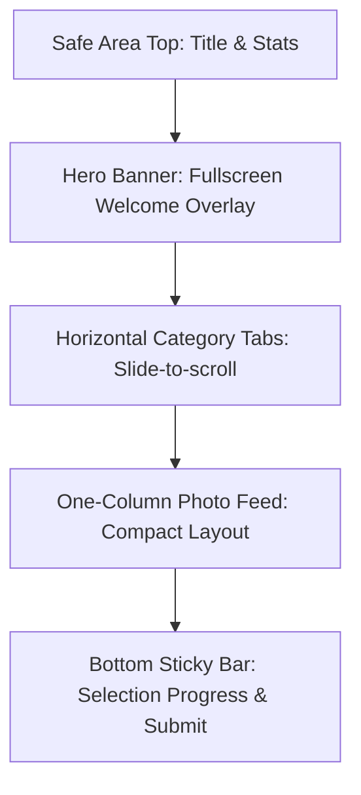

# Báo Cáo Audit Hệ Thống Shotpik & Bản Thiết Kế Giao Diện Album Chọn Ảnh Mood Studio V2

> [!NOTE]
> Báo cáo này tổng hợp kết quả phân tích sâu về giao diện người dùng (UI/UX) và logic vận hành thực tế của **Shotpik.com** dựa trên các dữ liệu trực quan đã thu thập. Từ đó, xây dựng bản thiết kế chi tiết (UI Blueprint) cho phân hệ quản lý và chọn ảnh trên **Mood V2**, áp dụng ngôn ngữ thiết kế tối giản của **Stripe** và triết lý sản phẩm đỉnh cao của **Apple HIG**.

---

## PHẦN I: CHI TIẾT AUDIT VẬN HÀNH THỰC TẾ SHOTPIK.COM

Qua quá trình khảo sát thực tế bằng visual agent trên tài khoản quản trị và khách hàng của hệ thống Shotpik, dưới đây là phân tích chi tiết về 4 màn hình cốt lõi:

### 1. Dashboard Quản Trị (Admin Dashboard)
*   **Giao diện trực quan:** 
*   **Bố cục & UX Grid:**
    *   Shotpik sử dụng Grid 4 cột để hiển thị các Album ảnh dưới dạng card lớn.
    *   Mỗi card hiển thị ảnh bìa nổi bật, đè text trắng bóng mờ (Overlay) ở góc dưới gồm: *Tên Album*, *Ngày tạo*, *Số lượt thích*, và *Số lượt bình luận*.
    *   Nút bấm "+ Tạo album" chiếm trọn vẹn ô đầu tiên của Grid dưới dạng một *Empty State Card* với viền đứt nét màu xanh nhẹ. Đây là một UX pattern rất tốt giúp kích thích hành động tạo mới ngay khi mở trang.
*   **Thanh công cụ phía trên (Top Navbar):**
    *   Phía bên trái: Logo thương hiệu, Nút bấm nổi bật `+ Tạo album` (màu cam nhạt) và nút `Thiết lập website` (màu xanh thương hiệu).
    *   Giữa Navbar: Stats bar thu nhỏ cho biết các chỉ số tài nguyên: *Tổng số album đã tạo (8)*, *Số album tạo mới trong tháng này (0/5)*, *Số website album tạo mới trong tháng (0/1)*. Điều này giúp kiểm soát hạn mức gói cước (SaaS quota tracking) rất trực quan.
    *   Phía bên phải: Ô tìm kiếm, biểu tượng trợ giúp, chuông thông báo, bộ chuyển đổi ngôn ngữ (VI/EN), nút toggle darkmode, và thông tin tài khoản user.

### 2. Luồng & Logic Tạo Album Mới (Modal "Tạo album")
*   **Giao diện trực quan:** 
*   **Logic nguồn cấp dữ liệu (Data Source Pipeline):**
    *   Shotpik không bắt buộc upload trực tiếp từ máy (giúp giảm tải băng thông và dung lượng lưu trữ cho server của họ). Thay vào đó, họ tích hợp sâu với **Google Drive**.
    *   Trường đầu tiên của Modal là `Link ảnh Google Drive` kèm một icon `+` để import nhanh toàn bộ thư mục ảnh từ Drive của nhiếp ảnh gia.
*   **Thông tin cơ bản:**
    *   `Tên album`, `Tên khách hàng`.
    *   `Tên miền album`: Cho phép tùy chỉnh URL dạng alias cá nhân hóa: `https://shotpik.com/albums/[sub-domain]`.
    *   `Tags`: Cho phép gắn tối đa 5 thẻ để phân loại nội dung (ví dụ: phóng sự, tiệc tối, chân dung).
*   **Hệ thống Cấu hình Quyền hạn & Bảo mật (Toggles):**
    *   *Cho phép bình luận:* Bật/tắt khả năng feedback trực tiếp trên ảnh.
    *   *Bật watermark:* Tự động đóng dấu bản quyền để bảo vệ ảnh trước khi thanh toán.
    *   *Hiện Name Card:* Hiển thị thông tin liên hệ của photographer ở góc giao diện khách hàng để làm phễu marketing.
    *   *Bảo vệ album bằng mật khẩu:* Đặt password truy cập riêng tư.
    *   *Cho phép tải xuống:* Cho phép khách hàng tải ảnh chất lượng cao hoặc khóa hoàn toàn.
    *   *Giới hạn số lượng ảnh được chọn:* Rất quan trọng để khống chế gói chụp (ví dụ: gói 50 ảnh, khách chỉ được chọn tối đa 50 tấm để photoshop).

### 3. Trang Quản Trị Chi Tiết Album (Admin Album Detail View)
*   **Giao diện trực quan:** 
*   **Bố cục Visual-First:**
    *   Đầu trang hiển thị một **Hero Banner** khổng lồ lấy từ ảnh bìa album, có nút `Thay đổi ảnh bìa` trực quan ở góc trên bên phải. Tiêu đề album và tên khách hàng được đặt làm text overlay màu trắng bóng đổ tinh tế ở góc dưới trái của banner.
    *   Ngay dưới banner là thanh công cụ thao tác nhanh:
        *   Bên trái: Các chỉ số tương tác thực tế bao gồm `Mắt xem (290)`, `Lượt thích (0)`, `Tổng số ảnh (114)`, `Bình luận (0)`.
        *   Bên phải: Các nút thao tác nghiệp vụ cực kỳ hay: `Tác vụ` (Dropdown chứa các tính năng nâng cao) và `Tùy chỉnh` (Cài đặt sâu cho album).
*   **Các tính năng nâng cao trong Dropdown `Tác vụ`:**
    *   
    *   *Chia sẻ album:* Mở modal lấy link chia sẻ cho khách hàng.
    *   *Lọc file trên Drive:* Quét lại thư mục Google Drive để cập nhật ảnh mới thêm hoặc xóa ảnh cũ.
    *   *Lọc file trên máy tính:* Hỗ trợ upload thêm ảnh offline từ local.
    *   *Nhận diện khuôn mặt:* Tính năng cực kỳ thời trưng giúp khách mời đi đám cưới chỉ cần selfie là hệ thống tự động lọc ra tất cả các tấm ảnh có mặt họ trong album 1000 tấm!
    *   *Tạo website:* Đóng gói album thành một Landing Page kỷ niệm riêng biệt với tên miền riêng.
    *   *Xem danh sách chọn:* Xem nhanh danh sách các ảnh mà khách hàng đã "Star" (yêu thích) để chuyển qua bộ phận chỉnh sửa màu (Retouch).
    *   *Tải xuống:* Tải nhanh file excel danh sách tên ảnh được chọn hoặc tải file zip ảnh đã lọc.
*   **Modal Chia Sẻ Phân Quyền Thông Minh:**
    *   
    *   Shotpik cung cấp song song **02 đường dẫn chia sẻ** tách biệt hoàn toàn về quyền hạn:
        1.  `Đường dẫn chia sẻ cho khách hàng chọn ảnh`: Khách truy cập vào đây sẽ có quyền nhấn nút Star chọn ảnh, viết bình luận, gửi yêu cầu retouch.
        2.  `Đường dẫn chia sẻ cho người xem (Chỉ xem)`: Dành cho bạn bè, người thân của cô dâu chú rể vào ngắm ảnh và chúc mừng. Đường dẫn này khóa hoàn toàn nút chọn ảnh (Star) và không thể xem danh sách ảnh chọn riêng tư của khách chính.
        3.  Cả 2 link đều đi kèm **Mã QR Code** có thể tải xuống file `.png` chất lượng cao để in ấn đặt tại bàn tiệc đám cưới.

### 4. Giao Diện Khách Hàng (Client Selection View)
*   **Landing Page Chào Mừng (Fullscreen Welcome Overlay):**
    *   
    *   Đây là điểm chạm UX xuất sắc nhất của Shotpik. Khi khách hàng mở link album, giao diện đầu tiên không phải là grid ảnh lộn xộn, mà là một màn hình **Welcome Screen bao phủ toàn bộ thiết bị (Fullscreen image background)** lấy chính ảnh bìa album làm nền mờ.
    *   Ở chính giữa màn hình hiển thị tiêu đề album cực kỳ trang trọng cùng nút bấm `Xem Album` được bo tròn tinh tế. Phía dưới cùng là dòng chữ cá nhân hóa: *"MOOD | KHUYEN - THUY"*. Giao diện này mang lại cảm giác cực kỳ cao cấp, giống như đang mở một cuốn sách ảnh nghệ thuật số cá nhân.
*   **Trang Photo Grid Trực Quan:**
    *   
    *   Sau khi click `Xem Album`, màn hình chuyển mượt mà sang dạng Grid hiển thị ảnh sắc nét.
    *   Các ảnh được phân chia theo **Hệ thống Tab phân loại** ở thanh điều hướng phụ (ví dụ: *Tất cả*, *LE CUOI*). Điều này giúp cô dâu chú rể lọc nhanh ảnh theo diễn biến buổi lễ mà không bị ngợp giữa hàng trăm file ảnh.
    *   Từng thumbnail ảnh khi hover/touch sẽ hiện icon **Star (Ngôi sao chọn ảnh)** ở góc trên trái. Khi click chọn, ngôi sao sẽ sáng lên kèm bộ đếm tổng số ảnh đã chọn ở góc trên cùng tăng lên theo thời gian thực.
    *   Khách hàng có thể nhấn vào bất kỳ ảnh nào để mở **Lightbox (Trình phóng to ảnh)** để xem chi tiết, viết comment trực tiếp hoặc nhấn nút `Chọn ảnh này`. Đặc biệt, tên file gốc (ví dụ: `DSC_1290.jpg`) luôn được hiển thị rõ ràng để khách tiện đối chiếu.

---

## PHẦN II: BLUEPRINT TÍCH HỢP & TỐI ƯU HÓA CHO MOOD STUDIO V2

> [!TIP]
> Nhìn nhận từ Shotpik, Mood Studio V2 có cơ hội vàng để tạo ra một phân hệ quản lý & bàn giao ảnh cưới vượt trội hơn hẳn nhờ tận dụng được thế mạnh của một **Hệ sinh thái CRM & Vận hành Studio khép kín**. Khách hàng của Mood Studio không cần phải dùng app ngoài, mọi thứ sẽ đồng bộ từ Hợp đồng -> Gói chụp -> Bàn giao ảnh chọn -> Chốt file retouch ngay trên 1 nền tảng duy nhất.

### 1. Phân Tích Điểm Tối Ưu Của Mood V2 so với Shotpik
*   **Đồng bộ dữ liệu tự động (Zero-Setup Pipeline):** 
    *   *Shotpik:* Nhiếp ảnh gia phải copy link Google Drive thủ công, tạo album mới, gõ lại tên khách hàng.
    *   *Mood V2:* Khi một Hợp đồng được ký, hệ thống **tự động tạo một Album Chọn Ảnh** tương ứng gắn liền với mã Hợp đồng đó. Khi folder ảnh của khách được upload lên Cloud Storage của Mood, hệ thống tự động đồng bộ ảnh vào Album mà không cần photographer phải setup một bước nào.
*   **Bảo vệ bản quyền bằng Watermark Động (Dynamic Watermark):**
    *   *Shotpik:* Đóng dấu tĩnh dạng ảnh đè lên.
    *   *Mood V2:* Tự động tạo Watermark chứa chính **Tên khách hàng + Số điện thoại + Logo Studio** chạy ẩn dưới dạng pattern chéo mờ. Khách hàng sẽ không thể screenshot hay tải lậu ảnh trước khi thanh toán hết hợp đồng vì watermark mang tính định danh cá nhân rất cao.
*   **Tích hợp cổng thanh toán trực tiếp:**
    *   *Shotpik:* Chỉ đơn thuần là chọn ảnh, photographer phải tự liên hệ đòi tiền khách offline rồi mới gửi file gốc.
    *   *Mood V2:* Áp dụng triết lý thanh toán siêu tốc của **Stripe**. Khách hàng chọn xong ảnh, hệ thống hiển thị nút `Thanh toán số tiền còn lại của Hợp đồng` (hoặc mua thêm ảnh retouch vượt định mức với giá X.000đ/tấm). Khách chuyển khoản/quét QR thanh toán xong, hệ thống **tự động mở khóa nút Tải ảnh chất lượng cao** và gửi folder Google Drive gốc cho khách mà không cần Studio can thiệp thủ công!

---

## PHẦN III: THIẾT KẾ UI/UX TÍNH NĂNG CHỌN ẢNH MOOD V2 (APPLE HIG & STRIPE STYLE)

Nhằm mang lại trải nghiệm thị giác đỉnh cao, đánh gục khách hàng ngay từ cái nhìn đầu tiên, giao diện phân hệ Chọn ảnh Mood V2 được xây dựng dựa trên sự giao thoa giữa **Apple HIG (Visual-First, Smooth Typography, Safe Areas)** và **Stripe (Neutral Dark Palette, Micro-interactions, Sleek Borders, Ultra-clean Layout)**.

### Hệ Thống Token Thiết Kế Đồng Bộ (Design Tokens SSOT)

*   **Font chữ:** `San Francisco Pro` (chữ mặc định của hệ sinh thái Apple mang lại sự quen thuộc, tinh tế và khả năng đọc tối ưu ở mọi kích thước).
*   **Bảng màu Semantic Apple + Neutral Stripe:**
    ```css
    :root {
      /* Theme: Dark Mode Premium */
      --bg-primary: #09090b;       /* Tối sâu - chuẩn Stripe Dashboard */
      --bg-secondary: #18181b;     /* Card background */
      --border-subtle: #27272a;    /* Viền cực mảnh, tinh tế */
      
      /* Semantic Colors (Apple HIG) */
      --apple-gold: #d4af37;       /* Màu nhấn thương hiệu cưới cao cấp */
      --apple-blue: #007aff;       /* Màu action mặc định của iOS */
      --apple-green: #34c759;      /* Trạng thái thành công, đã chọn */
      --apple-red: #ff3b30;        /* Trạng thái xóa, cảnh báo */
      
      /* Text Colors */
      --text-main: #f4f4f5;        /* Trắng ấm, không mỏi mắt */
      --text-muted: #a1a1aa;       /* Xám mô tả */
      
      /* Shapes & Shadows */
      --radius-ios: 12px;          /* Góc bo chuẩn của Apple element */
      --radius-stripe: 6px;        /* Góc bo chuẩn của input/button Stripe */
      --shadow-premium: 0 4px 20px rgba(0, 0, 0, 0.4);
    }
    ```
*   **Thang spacing (Apple HIG Standard):** `4px` | `8px` | `12px` | `16px` | `24px` | `32px` | `48px`.

---

### 1. PHIÊN BẢN MOBILE iOS (375px)

Thiết kế tối ưu cho trải nghiệm một tay trên thiết bị di động, đảm bảo an toàn tuyệt đối cho Safe Areas (Dynamic Island & Home Indicator).



#### A. Layout & Bố Cục
*   Thiết kế dạng **1 cột dọc duy nhất** cuộn vô tận. 
*   **Safe-area margins:** 16px ở hai cạnh bên để tránh tràn viền cong của iPhone.
*   Header cố định (Sticky Top) cao 56px tích hợp bộ đếm ảnh chọn mượt mà.
*   Thanh điều khiển hành động (Sticky Bottom Bar) cao 68px nằm trên vạch Home Indicator của iOS.

#### B. Điều Hướng (Navigation)
*   **Tab điều hướng danh mục:** Sử dụng dải tab ngang vuốt chạm (Horizontal Swipe Container) với hiệu ứng trượt mượt mà bằng CSS `overflow-x: auto` và `scroll-snap-type: x mandatory`.
*   **Quay lại (Back):** Nút quay lại kiểu iOS nằm ở góc trên bên trái dưới dạng icon chevron mỏng của SF Symbols (`chevron.backward`).

#### C. Thành Phần UI (UI Components)
*   **Welcome Card:** Ảnh bìa chiếm trọn tỷ lệ màn hình dọc 16:9, text overlay hiển thị hoa văn cưới hoàng gia mạ vàng (`--apple-gold`), nút `Xem ảnh` lớn có hiệu ứng Glassmorphism (nền mờ 80% độ trong suốt kèm blur 10px).
*   **Photo Thumbnail:** Bo tròn `var(--radius-ios)`. Icon chọn ảnh nằm ở góc trên bên phải là một nút hình tròn bán trong suốt, khi click sẽ biến đổi thành ngôi sao vàng sáng rực (`star.fill` của SF Symbols) bằng hiệu ứng bung hạt (Particle Burst Animation).

#### D. Typography & Màu sắc (iOS Specific)
*   **Tiêu đề:** `SF Pro Display Bold`, 20px, line-height 24px, màu `--text-main`.
*   **Stats/Labels:** `SF Pro Text Regular`, 12px, màu `--text-muted`.
*   **Active States:** Màu chữ vàng `--apple-gold` kết hợp viền dưới mảnh 2px.

#### E. Animation & Interaction
*   **Haptic Feedback:** Tích hợp bộ rung nhẹ của hệ thống (nếu chạy PWA/Native) khi khách nhấn chọn ảnh.
*   **Slide-in Drawer:** Khi nhấn vào ảnh để xem chi tiết, cửa sổ chi tiết ảnh (Lightbox) sẽ trượt từ dưới lên (Standard iOS Bottom Sheet) chiếm 85% chiều cao màn hình. Người dùng có thể vuốt dọc xuống để đóng cửa sổ này.

---

### 2. PHIÊN BẢN DESKTOP macOS/WEB (1440px)

Tận dụng tối đa không gian màn hình rộng lớn của Mac/PC để trưng bày sản phẩm nghệ thuật cưới của Studio với bố cục đa cột chuẩn Stripe Dashboard.

```
+------------------------------------------------------------------------------------+
|  MOOD STUDIO V2  [ Logo ]     Home  |  Contracts  |  Photos  |  Settings    [ Han ]|
+------------------------------------------------------------------------------------+
|  [                                  HERO BANNER                                 ]  |
|  [                      Ảnh Bìa Album Đám Cưới Khuyên - Thủy                    ]  |
+------------------------------------------------------------------------------------+
|  Tất cả  |  Lễ Hỏi  |  Tiệc Cưới  [ Stats: 114 ảnh | 290 lượt xem ]  [ Tác vụ ] [v] |
+------------------------------------------------------------------------------------+
|  +--------------+  +--------------+  +--------------+  +--------------+            |
|  | [Star]       |  | [Star]       |  | [Star]       |  | [Star]       |            |
|  |              |  |              |  |              |  |              |            |
|  |              |  |              |  |              |  |              |            |
|  | Photo 1      |  | Photo 2      |  | Photo 3      |  | Photo 4      |            |
|  +--------------+  +--------------+  +--------------+  +--------------+            |
|  +--------------+  +--------------+  +--------------+  +--------------+            |
|  | [Star]       |  | [Star]       |  | [Star]       |  | [Star]       |            |
|  |              |  |              |  |              |  |              |            |
|  |              |  |              |  |              |  |              |            |
|  | Photo 5      |  | Photo 6      |  | Photo 7      |  | Photo 8      |            |
|  +--------------+  +--------------+  +--------------+  +--------------+            |
+------------------------------------------------------------------------------------+
|  [ Giỏ Ảnh Đã Chọn: 12 / 50 tấm ]                                  [ Tiếp Tục -> ]|
+------------------------------------------------------------------------------------+
```

#### A. Layout & Bố Cục
*   **Hệ thống Grid:** Áp dụng hệ thống Grid 12 cột tiêu chuẩn của Bootstrap/Stripe.
*   **Bố cục lưới ảnh (Photo Grid Layout):** Tự động dàn trang từ 4 đến 5 cột tùy thuộc kích thước màn hình sử dụng CSS Grid: `grid-template-columns: repeat(auto-fill, minmax(280px, 1fr))`.
*   **Khoảng cách giữa các phần tử (Gap):** 24px để tạo không gian "thở" (Negative Space) chuẩn phong cách tối giản cao cấp.

#### B. Điều Hướng (Navigation)
*   Thanh điều hướng chính ở trên cùng (Navbar Header) cao 72px với logo Mood tối giản bên trái, menu điều hướng dạng text liên kết mảnh ở giữa, và Avatar tài khoản kèm menu thả xuống bên phải.
*   Thanh điều hướng danh mục Album (Category Filter) được cố định cố định khi cuộn trang (Sticky Sidebar hoặc Sticky Tab Bar) giúp chuyển đổi nhanh các tệp ảnh mà không mất công cuộn ngược lên.

#### C. Thành Phần UI (UI Components)
*   **Hero Banner Cực Đại:** Chiều rộng full-width màn hình 1440px, chiều cao cố định 360px. Ảnh bìa được phủ một lớp gradient chuyển từ trong suốt ở giữa sang đen sâu ở các rìa (`background: linear-gradient(180deg, rgba(0,0,0,0.1) 0%, rgba(9,9,11,0.9) 100%)`).
*   **Stripe-style Selection Box:** Giỏ hiển thị danh sách ảnh đã chọn ở góc dưới màn hình. Được thiết kế dạng thanh bar nổi bo viền mảnh 1px màu `--border-subtle`, nền hiệu ứng kính mờ, đổ bóng nhẹ nhàng.
*   **Premium Interactive Buttons:** Nút bấm có góc bo `var(--radius-stripe)` sắc sảo, nút phụ dùng viền mảnh border-1px, nút chính sử dụng màu đen bóng bẩy hoặc màu vàng mạ (`--apple-gold`) có hiệu ứng chuyển màu gradient Stripe-style siêu mượt khi hover.

#### D. Typography & Màu sắc (Desktop Specific)
*   **Tiêu đề Lớn (Hero Title):** `SF Pro Display SemiBold`, 36px, khoảng cách ký tự (letter-spacing) -0.02em giúp chữ gọn gàng, hiện đại.
*   **Chữ Nội Dung (Body text):** `SF Pro Text Regular`, 14px, line-height 20px, màu `--text-muted`.
*   **Hover states:** Text chuyển màu sáng hơn, border đổi màu từ `--border-subtle` sang `--apple-gold` với transition dài 0.2s.

#### E. Animation & Interaction
*   **Hover Zoom Effect:** Khi rê chuột vào bất kỳ thumbnail ảnh nào, ảnh đó sẽ tự động phóng to nhẹ nhàng `scale(1.03)` và hiện mượt mà các nút tác vụ ẩn (Star, Xem chi tiết, Bình luận) nhờ CSS transition `all 0.3s cubic-bezier(0.16, 1, 0.3, 1)`.
*   **Slide-in Panel (Sidebar Lightbox):** Nhấn vào ảnh sẽ mở ra một trình xem ảnh toàn diện dạng Modal lồng Panel trượt từ cạnh phải sang (Right Drawer Panel) rộng 450px để hiển thị các bình luận, lịch sử trao đổi chỉnh sửa ảnh giữa Studio và Khách hàng mà không che mất lưới ảnh bên trái.

---

### 3. LOGIC MỞ RỘNG & PHẢN HỒI PHẢN ỨNG (RESPONSIVE LOGIC)

Để đảm bảo nhận diện thị giác đồng bộ 100% trên mọi thiết bị nhưng vẫn tối ưu hóa được công năng sử dụng thực tế, Mood V2 áp dụng logic chuyển đổi linh hoạt sau:

| Thành Phần UI | Trải Nghiệm Trên Mobile iOS (375px) | Cách Mở Rộng Lên Desktop (1440px) | Logic Chuyển Đổi Kỹ Thuật (Responsive CSS/JS) |
| :--- | :--- | :--- | :--- |
| **Bố cục lưới ảnh** | Lưới 2 cột dọc compact để cuộn nhanh một ngón tay. | Lưới 4-5 cột rộng mở, khoe trọn vẹn chất lượng ảnh gốc. | Dùng CSS Grid `grid-template-columns: repeat(auto-fill, minmax(160px, 1fr))` trên mobile tự chuyển sang `minmax(280px, 1fr)` trên desktop. |
| **Giao diện Lightbox** | Trượt từ dưới lên (Bottom Sheet) để người dùng dễ vuốt chạm đóng tab bằng 1 ngón tay. | Modal phóng to toàn màn hình (Fullscreen Slider) kèm Right Panel chứa bình luận và metadata. | JS Detect Screen Width: Nếu `< 768px` render component `BottomDrawer`, nếu `>= 768px` render component `DesktopModal`. |
| **Giỏ chọn ảnh** | Thu gọn thành một vòng tròn nổi (Float Action Button) có số đếm ở góc dưới phải màn hình. | Thanh Bar ngang cố định ở đáy màn hình (Sticky Bottom Bar) hiển thị các thumbnail ảnh thu nhỏ đã chọn. | CSS Media Queries: `display: none` cho thanh bar ngang trên Mobile, thay thế bằng Floating Button và ngược lại. |
| **Menu điều hướng** | Chuyển toàn bộ các link quản trị vào Hamburger Menu hoặc thanh Bottom Navigation Bar 4 nút chuẩn iOS. | Dàn ngang sang trọng trên Navbar trên cùng của màn hình lớn, tích hợp dropdown tương tác. | Sử dụng component điều hướng thích ứng (Adaptive Navigation Component). |

---

## PHẦN IV: KHUYẾN NGHỊ LỘ TRÌNH TRIỂN KHAI CHO MOOD STUDIO V2

> [!IMPORTANT]
> Đây là lộ trình 3 bước giúp Mood V2 xây dựng tính năng này một cách tinh gọn nhất nhưng vẫn đạt hiệu quả visual cao nhất:

1.  **Giai đoạn 1: Build Core Pipeline (Đồng bộ Google Drive):**
    *   Tích hợp API Google Drive Picker để photographer cấp quyền và chọn thư mục ảnh nhanh.
    *   Tự động crawl tên ảnh và URL thu nhỏ lưu vào database PostgreSQL của Mood V2.
2.  **Giai đoạn 2: Phát triển UI Client (Apple HIG + Stripe Style):**
    *   Xây dựng màn hình Welcome Screen Fullscreen đẹp mắt để lấy lòng cô dâu chú rể.
    *   Phát triển lưới ảnh responsive có nút Star và giỏ chọn ảnh thời gian thực bằng SWR/React Query để trạng thái không bị lag.
3.  **Giai đoạn 3: Đóng gói Quyền hạn & Payment Gateway:**
    *   Thiết lập logic khóa link tải ảnh gốc dựa trên trạng thái thanh toán của hợp đồng.
    *   Tích hợp QR thanh toán động của ngân hàng hoặc Stripe để khách thanh toán nốt hợp đồng và tự động nhận ảnh bàn giao chất lượng gốc trong 3 giây.
