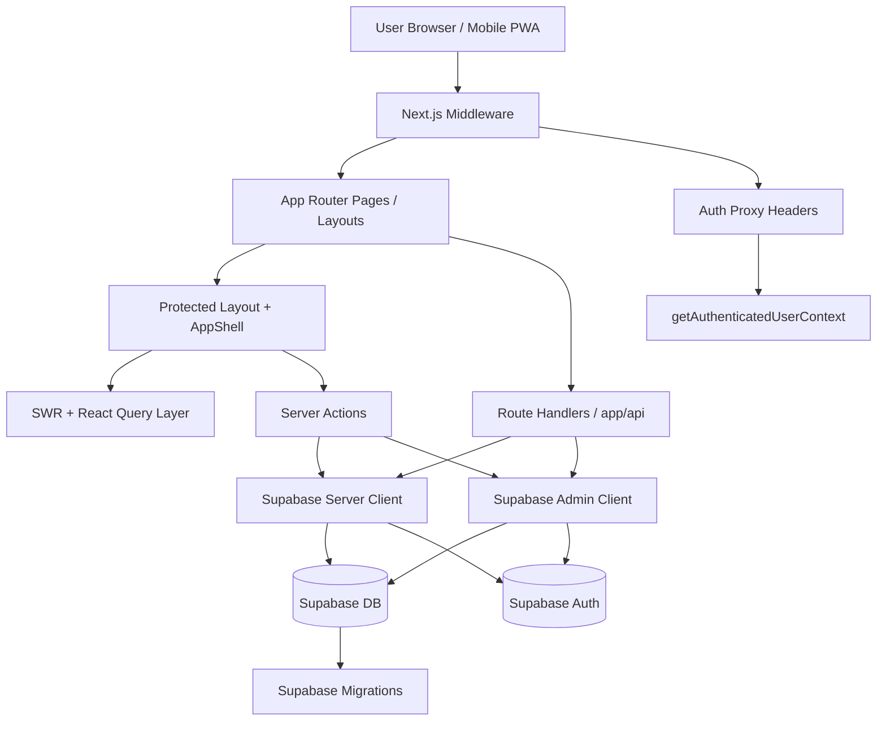
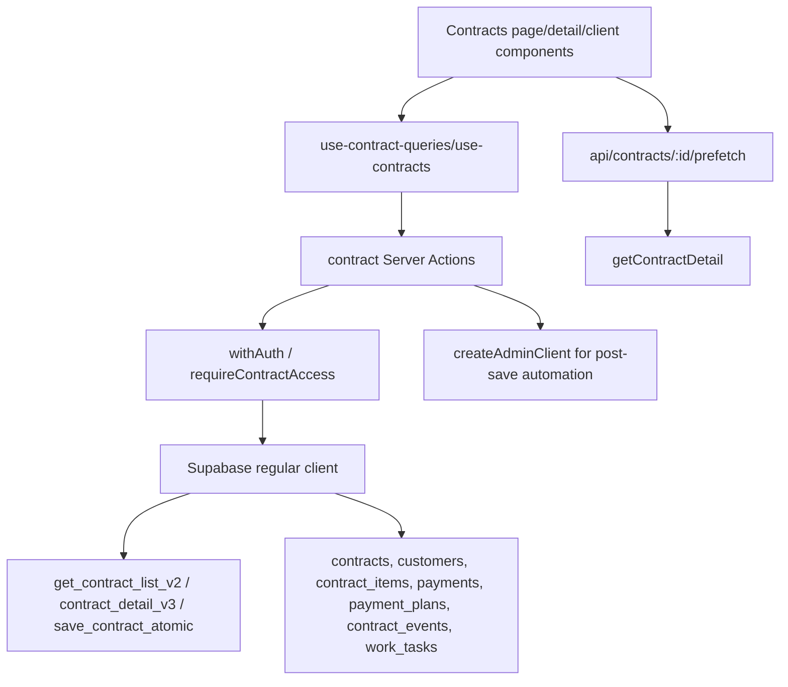
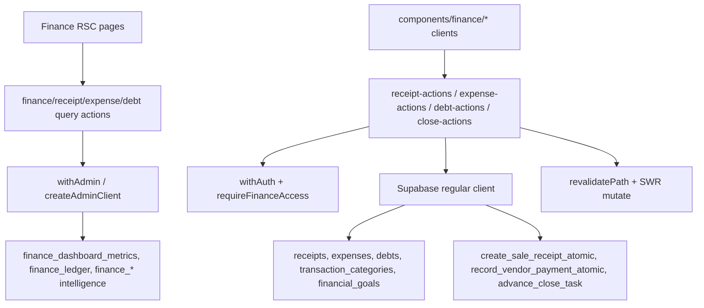
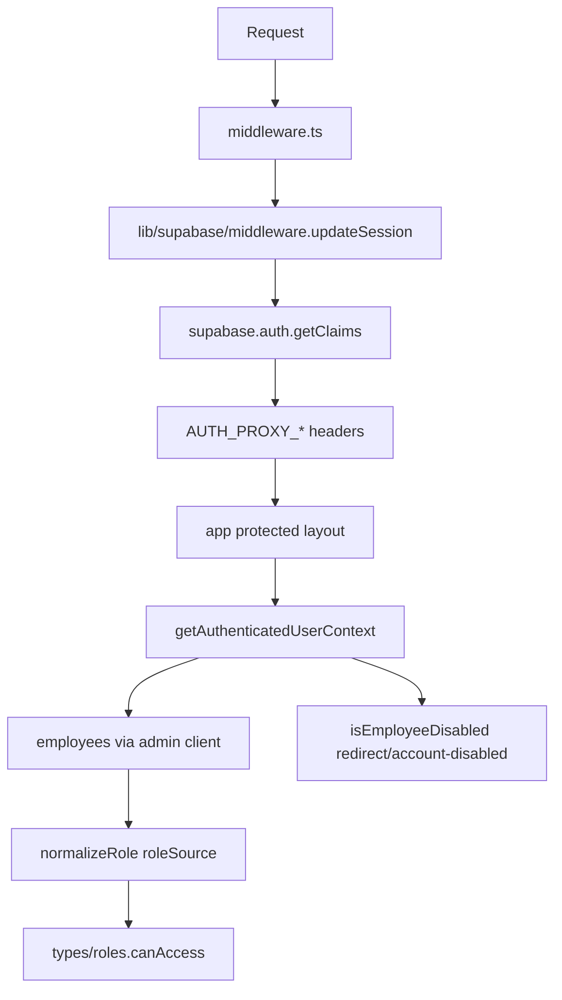

# Mood Studio — Architecture Overview

## Mục tiêu tài liệu

Tài liệu này tổng hợp bức tranh kiến trúc tổng quan của ứng dụng `mood-studio` dựa trên đợt audit cấu trúc và các file cấu hình/lõi đã được kiểm tra. Mục tiêu là tạo một “bản đồ dự án cố định” để những thay đổi tiếp theo có thể bám đúng context, tránh sửa sai lớp hoặc bỏ sót ràng buộc hệ thống.

> Phạm vi hiện tại là **architecture overview** ở mức hệ thống và module. Đây **chưa phải deep audit từng feature** hoặc review toàn bộ business logic.

---

## 1. Executive Summary

`mood-studio` là một ứng dụng **Next.js App Router** quy mô lớn, thiên về vận hành nội bộ/business operations cho studio, với nhiều domain nghiệp vụ cùng tồn tại trong một codebase:

- CRM
- hợp đồng
- tài chính
- kho/vật tư
- váy cưới
- in ấn/lab
- lịch làm việc
- nhân sự
- báo cáo
- cài đặt hệ thống
- trợ lý/AI nội bộ (`moodie`)

Hệ thống dùng **Supabase** làm backend platform chính cho:

- authentication/session
- database
- policy/RLS
- storage/integration nền tảng

Frontend được tổ chức theo **Next.js App Router + protected shell**, kết hợp:

- **Server Components / Server Actions**
- **middleware-based session refresh + auth proxy headers**
- **SWR + React Query** đồng thời
- **PWA/runtime caching** qua `next-pwa`
- **Sentry + bundle analyzer + Vercel insights**

Kiến trúc hiện tại cho thấy đây không phải app demo mà là một hệ thống đã được tối ưu dần theo nhu cầu thực tế: có offline support, caching strategy, auth performance profiling, mobile shell behavior, và các domain data tương đối sâu.

---

## 2. Những gì đã được audit

Đợt audit hiện tại đã xác nhận và/hoặc đọc trực tiếp các nhóm sau:

### 2.1 Config và entry-level files

- `next.config.ts`
- `tsconfig.json`
- `.env.example`
- `middleware.ts`
- `README.md`

### 2.2 Cấu trúc thư mục chính

- `app`
- `components`
- `hooks`
- `lib`
- `supabase/migrations`
- `tests`
- `plans`

### 2.3 Các file lõi đã đọc thêm

- `app/layout.tsx`
- `app/(protected)/layout.tsx`
- `lib/supabase/server.ts`
- `lib/supabase/middleware.ts`
- `lib/auth_utils.ts`
- `components/layout/app-shell.tsx`
- `lib/swr.ts`
- `lib/cache-invalidation.ts`

### 2.4 Ghi chú giới hạn

- `README.md` hiện vẫn là template mặc định từ create-next-app, không phản ánh kiến trúc thật.
- `mood-studio-review.md` không đọc được như text vì có vẻ là binary/non-UTF8.
- Chưa có deep read toàn bộ từng module business như contracts/finance/inventory/settings.

---

## 3. Công nghệ và nền tảng chính

## 3.1 Frontend framework

- **Next.js** với **App Router**
- TypeScript strict mode
- Path alias `@/*`

## 3.2 Data/backend platform

- **Supabase**
  - Auth
  - Database
  - RLS-aware access
  - Admin/service-role access cho server-side privileged operations

## 3.3 Client data layer

App đang dùng song song hai lớp cache/fetching:

- **SWR**: chủ yếu cho namespace cache-based invalidation theo key string/prefix
- **React Query**: ít nhất được dùng rõ trong contract query layer

Điều này cho thấy codebase đang ở trạng thái **hybrid data-fetch architecture**, có thể do tiến hóa theo thời gian hoặc chọn giải pháp khác nhau theo module.

## 3.4 Observability / optimization

- **Sentry**
- **@vercel/speed-insights**
- **Web Vitals reporting**
- **Bundle analyzer**
- Tối ưu import/package
- React Compiler bật trong config
- `sharp` externalized phía server

## 3.5 PWA / offline

- `next-pwa`
- offline fallback
- runtime caching cho Supabase endpoints
- service worker reload on online

---

## 4. Kiến trúc ứng dụng ở mức cao



Kiến trúc tổng thể cho thấy luồng chính là:

1. request đi qua middleware
2. middleware refresh/xác thực session và inject auth context tối thiểu vào headers
3. protected layout lấy auth context
4. AppShell render chrome điều hướng chính
5. page/component sử dụng server actions, route handlers, SWR hoặc React Query để lấy dữ liệu
6. Supabase đóng vai trò backend trung tâm

---

## 5. Cấu trúc runtime và layout

## 5.1 Root layout

`app/layout.tsx` là global composition layer của app. Đây là nơi ghép các concern cross-cutting:

- local font
- metadata/manifest/icons
- `ThemeProvider`
- `NuqsAdapter`
- `SWRProvider`
- `QueryProvider`
- `ModalProvider`
- top loading bar
- Vercel Speed Insights
- WebVitals reporter
- PWA helper components
- offline / slow-network indicators
- splash screen
- view transitions
- global toaster/modal rendering

### Ý nghĩa kiến trúc

Root layout cho thấy app được thiết kế như một **long-lived app shell/PWA experience**, không chỉ là website nhiều trang đơn giản.

## 5.2 Protected layout

`app/(protected)/layout.tsx` thực hiện gatekeeping cho toàn bộ vùng cần đăng nhập:

- gọi `getAuthenticatedUserContext()`
- nếu không có context → redirect `/login`
- nếu employee bị disabled → redirect `/account-disabled`
- nếu hợp lệ → render `AppShell`

### Ý nghĩa kiến trúc

Auth không chỉ dừng ở “logged in hay chưa”, mà còn gắn với **employee state** và **role-based shell experience**.

## 5.3 App shell

`components/layout/app-shell.tsx` là lớp UI shell trung tâm cho phần protected app:

- desktop/tablet sidebar
- mobile drawer sidebar
- header
- bottom navigation
- main scroll container
- route-specific layout behavior

Các route pattern đặc biệt đã được hard-code để thay đổi chrome/layout:

- print preview/fullpage
- calendar app-view
- moodie chat-view
- contract/service form pages
- gallery flush layout

### Ý nghĩa kiến trúc

AppShell đang đóng vai trò như một **application workspace manager**, không đơn thuần là layout wrapper. Điều này quan trọng khi sửa UI vì nhiều route phụ thuộc vào behavior đặc thù của shell.

---

## 6. Authentication và session architecture

## 6.1 Middleware-first auth flow

`middleware.ts` hiện chủ yếu gọi `updateSession(request)` từ `lib/supabase/middleware.ts`.

`updateSession()` làm các việc chính:

- tạo Supabase server client dựa trên request cookies
- xác định public routes
- gọi `supabase.auth.getClaims()`
- suy ra authenticated state
- inject các header auth-proxy xuống downstream request
- redirect unauthenticated user về `/login`
- redirect authenticated user khỏi `/login` sang `/dashboard`
- thêm `no-store` headers để tránh cache response auth-sensitive

## 6.2 Auth proxy headers

Middleware đẩy xuống các header dạng proxy như:

- source
- user sub/id
- email
- role
- full name

### Lợi ích

Cách làm này giảm nhu cầu lặp lại các lần gọi auth nặng ở tầng dưới, nhất là cho shell/auth context.

## 6.3 Auth context resolution

`lib/auth_utils.ts` cho thấy auth context được resolve theo hướng tối ưu:

1. ưu tiên lấy claims từ headers do middleware inject
2. fallback sang Supabase `getClaims()` nếu cần
3. lấy employee context từ bảng `employees` bằng **admin client**
4. map role/permission/shell role
5. xác định các cờ như disabled/manage settings/manage members

### Ý nghĩa kiến trúc

Danh tính người dùng trong app là sự kết hợp giữa:

- Supabase auth identity
- JWT/app metadata
- user metadata
- employee record nội bộ

Nói cách khác, **auth identity** và **business identity** là hai lớp riêng nhưng liên kết với nhau.

---

## 7. Supabase access model

## 7.1 Server client thường

`lib/supabase/server.ts` cung cấp `createClient()`:

- dùng `NEXT_PUBLIC_SUPABASE_URL`
- dùng `NEXT_PUBLIC_SUPABASE_ANON_KEY`
- đọc session từ cookies
- chịu ràng buộc bởi RLS

Đây là client nên được dùng cho hầu hết tác vụ server-side mang danh tính user thực.

## 7.2 Admin client

Cùng file cung cấp `createAdminClient()`:

- dùng `SUPABASE_SERVICE_ROLE_KEY`
- bypass RLS
- intended only for server-side privileged flows

Comment trong code đã cảnh báo rõ: chỉ dùng sau manual auth check.

### Ý nghĩa kiến trúc

App đang dùng mô hình dual-client rõ ràng:

- **User-context client** cho access đúng theo quyền dữ liệu
- **Privileged admin client** cho lookup nội bộ, sync identity, hoặc workflow cần vượt RLS

Nếu sửa feature liên quan dữ liệu, phải xác định đúng đang ở client nào; dùng sai sẽ gây hoặc lỗi quyền, hoặc rủi ro security.

---

## 8. Data fetching và cache strategy

## 8.1 SWR key namespace

`lib/swr.ts` định nghĩa `cacheKeys` rất rộng, bao phủ nhiều domain:

- customers/leads
- contracts/payments/receipts
- dresses
- inventory
- dashboard/reports
- finance
- calendar/jobs/productivity
- services
- employees/settings/notifications/printing/labs

### Nhận định

File này đóng vai trò gần như **cache namespace registry** của app.

## 8.2 Revalidation helpers

`lib/cache-invalidation.ts` cho thấy app có quy ước invalidate theo domain sau mutation:

- finance
- CRM
- employee
- service
- contract
- inventory
- dress
- printing
- calendar

## 8.3 React Query cho contracts

Riêng contract layer đang có invalidate qua `contractKeys` và `queryClient.invalidateQueries`, cho thấy contracts có thể đang dùng React Query nhiều hơn hoặc có query model riêng phức tạp hơn.

### Ý nghĩa kiến trúc

Data layer hiện không thuần nhất 100%. Khi sửa bug hoặc thêm feature, cần xác định:

- module đó đang dùng SWR hay React Query
- invalidate phải đi qua helper nào
- optimistic update có đang được dùng không

Nếu không, dễ gặp bug kiểu UI không refresh, stale data, hoặc refresh quá mức.

---

## 9. Routing và domain map

Từ inventory thư mục, app hiện có nhiều cụm route protected đáng chú ý:

- `dashboard`
- `crm`
- `finance`
- `inventory`
- `contracts`
- `printing`
- `productivity`
- `reports`
- `settings`
- `moodie`
- `employees`
- `dresses`
- `services`
- `calendar`
- auth-related pages

### Suy luận kiến trúc domain

Có thể xem app như một monolith nghiệp vụ với các bounded areas:

| Domain | Mục đích chính |
|---|---|
| CRM | khách hàng, leads, quan hệ bán hàng |
| Contracts | hợp đồng, receipts, events, gallery/workflow liên quan |
| Finance | thu chi, công nợ, ngân sách, forecast, close |
| Inventory | vật tư tiêu hao, transaction, sales options |
| Dresses | quản lý váy và cho thuê |
| Printing | đơn in, lab, công nợ lab |
| Calendar | lịch việc, lịch studio, có thể sync ngoài |
| Productivity | hiệu suất/chi tiết job theo nhân sự |
| Employees | hồ sơ nhân sự, role, trạng thái |
| Settings | cấu hình hệ thống/studio |
| Moodie | khu vực chat/assistant nội bộ |

---

## 10. API surface

Trong `app/api` có nhiều route handler phục vụ các integration/workflows hệ thống, gồm:

- auth
- calendar sync
- drive download
- gallery download
- push
- migrations
- monitoring
- test helpers

### Nhận định

Không phải mọi logic đều đi qua Server Actions. App có xu hướng **lai giữa App Router page/server actions và route handlers**. Điều này thường xuất hiện ở các case như:

- callback/integration
- file download/streaming
- push/service worker flows
- internal diagnostics/test endpoints

---

## 11. PWA, offline và mobile-first considerations

`next.config.ts` và root layout cho thấy ứng dụng đầu tư đáng kể cho PWA/mobile:

- manifest/icons/apple web app config
- service worker support
- offline fallback
- runtime caching cho Supabase API/storage/auth
- `reloadOnOnline`
- offline indicator
- slow network indicator
- splash screen
- mobile bottom nav
- safe-area aware spacing trong shell

### Ý nghĩa kiến trúc

App có vẻ được dùng thực tế trên mobile/PWA, không chỉ desktop browser. Mọi thay đổi ở shell, navigation, viewport, safe area, scroll container, service worker đều là vùng nhạy cảm.

---

## 12. Performance và tối ưu vận hành

Các dấu hiệu tối ưu đã hiện diện ở nhiều lớp:

- preconnect/dns-prefetch đến Supabase và Google Drive
- long-lived caching headers cho static assets/images/fonts
- bundle analyzer wrapper
- `optimizePackageImports`
- React Compiler
- auth profiling logs (`AUTH_CONTEXT_PROFILE*`)
- selective public route bypass trong middleware

### Nhận định

Đây là codebase đã từng gặp hoặc dự phòng các vấn đề performance thực tế, nhất là:

- auth shell latency
- mobile loading
- asset/network cost
- repeat navigation UX

---

## 13. Database evolution và migration footprint

Thư mục `supabase/migrations` được ghi nhận là khá lớn, bao phủ nhiều mảng:

- finance
- CRM
- inventory
- moodie
- system settings
- studio assets
- contracts hardening

### Ý nghĩa kiến trúc

Schema database không còn ở mức đơn giản. Khi chỉnh logic feature, cần coi migration history là một phần của architecture vì domain model đã tiến hóa đáng kể.

---

## 14. Rủi ro kiến trúc và điểm cần lưu ý khi sửa code

## 14.1 Auth không chỉ là login

Nhiều flow phụ thuộc đồng thời vào:

- Supabase session
- claims headers từ middleware
- employee record
- role normalization
- disabled state

Sửa một chỗ auth có thể ảnh hưởng toàn bộ protected shell.

## 14.2 Hybrid cache layer

Dùng song song SWR và React Query làm tăng nguy cơ:

- invalidate sai nơi
- stale UI
- duplicated fetching logic
- khó chuẩn hóa pattern mutation

## 14.3 AppShell là vùng ảnh hưởng rộng

Thay đổi layout/header/bottom nav/scroll logic có thể ảnh hưởng nhiều route đặc thù như:

- calendar
- moodie
- forms
- print
- gallery

## 14.4 Admin client là vùng nhạy cảm

Bất kỳ chỗ nào dùng `createAdminClient()` đều cần kiểm tra lại:

- manual auth check đã đủ chưa
- role check có đúng không
- có lộ dữ liệu vượt quyền không

## 14.5 PWA/service worker có thể gây bug khó tái hiện

Với app có offline/runtime caching, các bug kiểu “máy em không bị”, “deploy rồi vẫn thấy code cũ”, hoặc stale assets dễ xuất hiện hơn app web thường.

---

## 15. Bản đồ thư mục khái quát

```text
/workspace/mood-studio
├── app/                    # App Router pages, layouts, route handlers, actions
├── components/             # UI components, layout shell, providers
├── hooks/                  # custom hooks
├── lib/                    # auth, supabase clients, cache, utilities
├── supabase/
│   └── migrations/         # database evolution history
├── tests/                  # test suites
├── plans/                  # planning / project notes
├── .env.example            # env template
├── next.config.ts          # next + pwa + sentry + perf config
├── middleware.ts           # session/auth middleware entry
└── tsconfig.json           # TypeScript config
```

---

## 16. Kiến trúc vận hành đề xuất để team bám theo

Dựa trên audit hiện tại, khi tiếp tục làm việc trong repo này nên giữ model suy nghĩ như sau:

1. **Bắt đầu từ route/domain**: xác định bug hoặc feature thuộc module nào.
2. **Xác định auth boundary**: route public hay protected, có phụ thuộc employee state không.
3. **Xác định data path**:
   - Server Action?
   - Route Handler?
   - Supabase regular client hay admin client?
4. **Xác định cache layer**:
   - SWR?
   - React Query?
   - invalidate helper nào?
5. **Kiểm tra shell/layout impact**: có thuộc route pattern đặc biệt không.
6. **Kiểm tra migration/schema assumptions**: field/table/RPC có đang dựa trên migration cũ nào không.
7. **Nếu bug chỉ xảy ra trên mobile/PWA**: phải kiểm tra service worker, safe area, bottom nav, scroll container.

---

## 17. Đề xuất bước audit tiếp theo

Để biến overview này thành bộ tài liệu đủ mạnh cho maintain lâu dài, nên đi tiếp theo thứ tự:

### Ưu tiên 1

- audit sâu `contracts`
- audit sâu `finance`
- audit sâu `auth + roles + employees`

### Ưu tiên 2

- map toàn bộ `app/api`
- map các Server Actions theo domain
- map Supabase RPC/table dependencies

### Ưu tiên 3

- chuẩn hóa documentation cho cache layer
- review boundaries giữa SWR và React Query
- review PWA/service worker operational risks

---

## 18. Kết luận

Ở thời điểm hiện tại, `mood-studio` có thể được hiểu là một **Next.js + Supabase business operations monolith** với:

- protected application shell
- nhiều domain nghiệp vụ trong cùng một app
- auth/context nhiều lớp
- hybrid cache/data-fetch strategy
- mobile/PWA-aware UX
- migration footprint lớn

Audit trước đó đã đủ để tạo một **bản đồ tổng quan đáng tin cậy** cho việc tiếp tục sửa đổi. Tuy vậy, trước khi đụng đến một feature cụ thể, vẫn nên audit sâu module liên quan thay vì suy luận từ overview alone.

---


## 19. Deep-dive: Module Contracts

### 19.1 File chính và vai trò

| File | Vai trò |
|---|---|
| `app/(protected)/contracts/layout.tsx` | Gate protected route bằng `getAuthenticatedUserContext()` và `canAccess(shellRole, "contracts")`. |
| `app/(protected)/contracts/page.tsx` | RSC list page; prefetch song song `getContractList()` và `getContractStats()` rồi hydrate `ContractsListClient`. |
| `app/(protected)/contracts/create/page.tsx` | Entry tạo hợp đồng, render form client. |
| `app/(protected)/contracts/[id]/page.tsx` | RSC detail page, load gallery summary ban đầu và render detail client. |
| `app/(protected)/contracts/[id]/edit/page.tsx` | Entry chỉnh sửa hợp đồng. |
| `app/(protected)/contracts/[id]/print/page.tsx` | Print/export page; dùng `Promise.all()` lấy contract detail và studio info. |
| `app/(protected)/contracts/[id]/gallery/page.tsx` | Full-page gallery theo contract. |
| `app/api/contracts/[id]/prefetch/route.ts` | Route Handler prefetch contract detail cho hover/intersection. |
| `app/actions/contract-queries.ts` | Server Actions đọc contract list/stats/detail/edit payload/drawer extra. |
| `app/actions/contract-mutations.ts` | Server Actions tạo/sửa hợp đồng qua RPC atomic và đổi trạng thái. |
| `app/actions/contract-event-actions.ts` | Server Actions/RPC nội bộ sinh, sửa, thêm, xóa event hợp đồng. |
| `app/actions/contract-refund-actions.ts` | Tạo phiếu chi hoàn tiền cho hợp đồng đã hủy và invalidate cả contracts/finance. |
| `lib/hooks/use-contracts.ts` | SWR-era hooks và helper optimistic/cache cho detail/list/drawer. |
| `lib/hooks/use-contract-queries.ts` | React Query layer chính: `contractKeys`, `useContracts`, `useContractDetail`, mutations/invalidation. |
| `lib/hooks/use-prefetch-contract.ts` | Client prefetch route `/api/contracts/[id]/prefetch`. |
| `components/contracts/detail/payment-receipt-form.tsx` | UI thu tiền hợp đồng; gọi payment action rồi invalidate contracts + finance. |

### 19.2 Server Actions vs Route Handlers

| Loại | Function | File:line | Ghi chú |
|---|---|---:|---|
| Server Action | `getNextContractCode` | `app/actions/contract-queries.ts:197` | Đọc mã HĐ kế tiếp từ `contracts`. |
| Server Action | `getContractList` | `app/actions/contract-queries.ts:226` | Ưu tiên RPC `get_contract_list_v2`; fallback query bảng. |
| Server Action | `getContractStats` | `app/actions/contract-queries.ts:390` | RPC `contract_stats`/`contract_stats_simple`; fallback count. |
| Server Action | `getContractDetail` | `app/actions/contract-queries.ts:503` | RPC detail v3/v2 theo `p_contract_id`. |
| Server Action | `getContractDrawerExtra` | `app/actions/contract-queries.ts:554` | Query `contract_events`, `contract_checklists`, `work_tasks`, `payment_plans`. |
| Server Action | `getContractForEdit` | `app/actions/contract-queries.ts:614` | Load `contracts` + `contract_items` + `payments`. |
| Server Action | `createContract` | `app/actions/contract-mutations.ts:77` | Validate schema rồi gọi `save_contract_atomic`. |
| Server Action | `updateContractStatus` | `app/actions/contract-mutations.ts:296` | Destructive access; update status trực tiếp bảng `contracts`. |
| Server Action | `generateContractEvents` | `app/actions/contract-event-actions.ts:272` | Sinh event/checklist từ templates. |
| Server Action | `updateContractEvent` | `app/actions/contract-event-actions.ts:290` | Update `contract_events`, có logic sync work tasks. |
| Server Action | `addContractEvent` | `app/actions/contract-event-actions.ts:438` | Insert `contract_events`. |
| Server Action | `deleteContractEvent` | `app/actions/contract-event-actions.ts:503` | Soft-delete/cascade work tasks liên quan. |
| Route Handler | `GET` | `app/api/contracts/[id]/prefetch/route.ts:12` | Gọi `getContractDetail(contractId)`, trả JSON cho client prefetch. |

```ts
// app/api/contracts/[id]/prefetch/route.ts:12
export async function GET(
  request: NextRequest,
  { params }: { params: Promise<{ id: string }> }
) {
  const { id: contractId } = await params;
  const data = await getContractDetail(contractId);
```

### 19.3 Data flow



- Regular client được tạo tại `lib/supabase/server.ts:8` qua `createClient = cache(async () => ...)`, dùng cookie/JWT user và chịu RLS.
- Admin client được tạo tại `lib/supabase/server.ts:31`, comment ghi rõ bypass RLS và chỉ dùng sau manual auth check; contracts dùng trong post-save automation tại `app/actions/contract-mutations.ts:222`, `app/actions/contract-mutations.ts:229`, `app/actions/contract-mutations.ts:251` và event internals tại `app/actions/contract-event-actions.ts:49`, `app/actions/contract-event-actions.ts:60`.
- List flow: `app/(protected)/contracts/page.tsx:35` gọi `Promise.all([getContractList, getContractStats])`; `getContractList` gọi RPC tại `app/actions/contract-queries.ts:163`.
- Detail flow: `lib/hooks/use-prefetch-contract.ts:37` fetch `/api/contracts/${contractId}/prefetch`; route gọi `getContractDetail`; action chạy `requireContractAccess` song song RPC tại `app/actions/contract-queries.ts:517` và `app/actions/contract-queries.ts:518`.
- Mutation flow: form gọi `createContract`; action check `requireContractWriteAccess` tại `app/actions/contract-mutations.ts:91`, gọi RPC `save_contract_atomic` tại `app/actions/contract-mutations.ts:170`, rồi post-save sinh events/checklists/reservations/addon history.

### 19.4 Cache/invalidation pattern

- React Query key factory ở `lib/hooks/use-contract-queries.ts:47`: `all`, `lists`, `list(filters)`, `stats`, `detail(id)`, `drawerExtra(id)`, `employees`.
- React Query hooks bắt đầu tại `lib/hooks/use-contract-queries.ts:163` (`useContracts`), dùng `useQuery` và `queryClient.invalidateQueries` cho list/stats/detail/drawer.
- SWR key factory cũ ở `lib/hooks/use-contracts.ts`: `list(filters) => ["contracts", JSON.stringify(filters)]`, `stats => ["contract-stats"]`, `detail => ["contract", id]`, `drawerExtra => ["contract-drawer-extra", id]`.
- SSOT client invalidation ở `lib/cache-invalidation.ts` với `revalidateContractCaches(contractId)` invalidate `contractKeys.detail(id)`, `drawerExtra(id)`, `lists()`, `stats()`; alias `invalidateContractAfterWrite` trỏ về helper này.
- Cross-domain mutation: `components/contracts/detail/payment-receipt-form.tsx:383` và `components/contracts/detail/payment-receipt-form.tsx:384` gọi đồng thời `invalidateContractAfterWrite(contractId)` và `invalidateFinanceAfterWrite()` sau khi tạo phiếu thu.
- Route prefetch dùng React Query key riêng `['contract-detail', contractId]` trong `lib/hooks/use-prefetch-contract.ts:35`, khác với `contractKeys.detail(id)`; đây là một cache island riêng.

### 19.5 Bảng/RPC Supabase liên quan

| Bảng/RPC | Quan hệ/ràng buộc thấy trong migrations/code |
|---|---|
| `contracts` | Trung tâm domain; join `customers`, `contract_items`, `payments`, `payment_plans`, `contract_events`, `work_tasks`; soft delete qua `deleted_at`. |
| `contract_items` | Child của contract; form edit lọc `deleted_at`; item có `service_id`, `dress_id`, `export_type`, `is_addon`. |
| `payments` | Gắn `contract_id`; migration finance thêm index `idx_payments_contract`; payment RPC cập nhật `paid_amount`, `remaining_amount`, `payment_status`. |
| `payment_plans` | Gắn contract; `process_contract_payment_v2` update plan `status='paid'` và allocation. |
| `contract_events` | Migration `20260422160000_contracts_business_logic_backfill.sql:9` bổ sung `template_id`; action CRUD ở `contract-event-actions.ts`. |
| `event_templates` | Tạo tại `supabase/migrations/20260422160000_contracts_business_logic_backfill.sql:12`, RLS read authenticated. |
| `dress_reservations` | Trigger refresh dress status tại `supabase/migrations/20260422160000_contracts_business_logic_backfill.sql:147` và `supabase/migrations/20260422160000_contracts_business_logic_backfill.sql:150`. |
| `receipts`/`expenses` | Contract payment/refund bridge sang finance; `expenses.contract_id` được đọc trong refund summary. |
| RPC `get_contract_list_v2` | Mới nhất có events ở `supabase/migrations/20260621100000_contract_list_v2_add_events.sql:3`. |
| RPC `process_contract_payment_v2` | Tạo tại `supabase/migrations/20260422160000_contracts_business_logic_backfill.sql:152`; grant service_role tại `supabase/migrations/20260422160000_contracts_business_logic_backfill.sql:472`. |
| RPC `save_contract_atomic` | Gọi tại `app/actions/contract-mutations.ts:170`; các migration sau harden/backfill business logic. |

```sql
-- supabase/migrations/20260422160000_contracts_business_logic_backfill.sql:236
v_payment_status := CASE
  WHEN (v_contract.paid_amount + p_amount) >= v_contract.total_amount THEN 'da_thanh_toan'
  WHEN (v_contract.paid_amount + p_amount) > 0 THEN 'thanh_toan_mot_phan'
  ELSE 'chua_thanh_toan'
END;
```

### 19.6 Rủi ro/gotcha cụ thể

- `lib/hooks/use-prefetch-contract.ts:35` dùng query key `['contract-detail', contractId]` trong khi React Query SSOT dùng `contractKeys.detail(id)` tại `lib/hooks/use-contract-queries.ts:47`; prefetch có thể không hydrate đúng cache mà detail hook đang đọc.
- `app/actions/contract-queries.ts:517` và `app/actions/contract-queries.ts:518` chạy `requireContractAccess` song song với RPC. Nếu RPC nặng và user không có quyền, DB vẫn có thể nhận RPC trước khi promise reject; hiện comment nói an toàn cho READ, nhưng không tiết kiệm tài nguyên.
- `app/actions/contract-mutations.ts:170` dùng regular `supabase.rpc("save_contract_atomic")` nhưng post-save dùng `createAdminClient` ở `app/actions/contract-mutations.ts:222`, `app/actions/contract-mutations.ts:229`, `app/actions/contract-mutations.ts:251`. Nếu post-save fail thì action chỉ gom `warnings`, dẫn tới contract đã lưu nhưng automation/events/reservations có thể thiếu một phần.
- `components/contracts/detail/payment-receipt-form.tsx:383` và `components/contracts/detail/payment-receipt-form.tsx:384` invalidate cả contract và finance sau tạo receipt; caller khác nếu quên cả hai invalidation thì tổng tiền finance/contract dễ stale tạm thời.

---

## 20. Deep-dive: Module Finance

### 20.1 File chính và vai trò

| File | Vai trò |
|---|---|
| `app/(protected)/finance/layout.tsx` | Gate route bằng `canAccess(context.shellRole, "finance")`. |
| `app/(protected)/finance/page.tsx` | Finance landing; truyền shell role cho client. |
| `app/(protected)/finance/dashboard/page.tsx` | Dashboard tài chính, đọc metrics/ledger/RPC qua actions. |
| `app/(protected)/finance/receipts/page.tsx` | Danh sách phiếu thu. |
| `app/(protected)/finance/expenses/page.tsx` | Danh sách phiếu chi. |
| `app/(protected)/finance/debts/page.tsx` | Công nợ khách hàng. |
| `app/(protected)/finance/vendor-debts/page.tsx` | Công nợ vendor. |
| `app/(protected)/finance/budget/page.tsx` | Ngân sách/budget vs actual. |
| `app/(protected)/finance/goals/page.tsx` | Mục tiêu tài chính và contributions. |
| `app/(protected)/finance/closes/page.tsx` | Danh sách khóa sổ tháng. |
| `app/(protected)/finance/closes/[id]/page.tsx` | Chi tiết close tasks. |
| `app/actions/receipt-actions.ts` | CRUD receipt, sale receipt atomic, delete/update with lock. |
| `app/actions/expense-actions.ts` | CRUD/approve expense, gắn contract refund/cost. |
| `app/actions/debt-actions.ts` | CRUD/pay/delete debt, sinh cashflow receipts/expenses. |
| `app/actions/finance-close-actions.ts` | Monthly close và close task workflow. |
| `app/actions/finance-dashboard-queries.ts` | Dashboard RPC queries. |
| `app/actions/finance-operations-queries.ts` | Receipts/expenses/debts/categories operational reads. |
| `app/actions/finance-intelligence-queries.ts` | Forecast/intelligence RPCs. |
| `app/actions/vendor-payment-actions.ts` | Vendor payment atomic RPC và void. |
| `lib/finance-utils.ts` | `checkPeriodLock`, `callRpcWithFallback`, date helpers. |
| `components/finance/finance-realtime-refresh.tsx` | Finance realtime invalidation bằng `router.refresh()`, không patch payload. |

### 20.2 Server Actions vs Route Handlers

Finance trong phạm vi audit này dùng Server Actions, không thấy `app/api/finance/*` route handler tương ứng.

| Function | File:line | Supabase path | RevalidatePath sau mutation |
|---|---:|---|---|
| `createReceipt` | `app/actions/receipt-actions.ts:95` | Insert `receipts`/contract payment | `/finance` tại `app/actions/receipt-actions.ts:177` |
| `updateReceipt` | `app/actions/receipt-actions.ts:184` | Update receipt với optimistic lock schema | `/finance` tại `app/actions/receipt-actions.ts:271` |
| `createSaleReceipt` | `app/actions/receipt-actions.ts:278` | RPC `create_sale_receipt_atomic` | `/finance` tại `app/actions/receipt-actions.ts:342`, thêm `/inventory` và `/reports` sau đó |
| `deleteReceipt` | `app/actions/receipt-actions.ts:44` | Soft-delete/reverse | `/finance` tại `app/actions/receipt-actions.ts:84`, `/inventory` tại `app/actions/receipt-actions.ts:86`, `/reports` tại `app/actions/receipt-actions.ts:87` |
| `approveExpense` | `app/actions/expense-actions.ts:27` | Update `expenses.approved_by` | `/finance` tại `app/actions/expense-actions.ts:56` |
| `createExpense` | `app/actions/expense-actions.ts:62` | Insert `expenses` | `/finance` tại `app/actions/expense-actions.ts:95`, `/contracts` tại `app/actions/expense-actions.ts:96` |
| `updateExpense` | `app/actions/expense-actions.ts:102` | Update `expenses` | `/finance` tại `app/actions/expense-actions.ts:168`, `/contracts` tại `app/actions/expense-actions.ts:169` |
| `deleteExpense` | `app/actions/expense-actions.ts:175` | Soft delete `expenses` | `/finance` tại `app/actions/expense-actions.ts:213` |
| `createDebt` | `app/actions/debt-actions.ts:58` | Insert `debts` | `/finance` tại `app/actions/debt-actions.ts:109` |
| `updateDebt` | `app/actions/debt-actions.ts:114` | Update `debts` | `/finance` tại `app/actions/debt-actions.ts:198` |
| `payDebt` | `app/actions/debt-actions.ts:203` | Pay debt, recalc status, create receipt/expense | `/finance` tại `app/actions/debt-actions.ts:294` |
| `deleteDebt` | `app/actions/debt-actions.ts:299` | Soft delete debt | `/finance` tại `app/actions/debt-actions.ts:329` |
| `markInstallmentPaid` | `app/actions/debt-actions.ts:334` | Update installment/debt | `/finance` tại `app/actions/debt-actions.ts:389` |
| `createMonthlyClose` | `app/actions/finance-close-actions.ts:122` | Insert `finance_monthly_closes` + tasks | Helper revalidates `/finance`, `/finance/closes`, detail tại `app/actions/finance-close-actions.ts:117`-`119` |
| `advanceCloseTask` | `app/actions/finance-close-actions.ts:187` | RPC `advance_close_task` | Helper revalidates `/finance`, `/finance/closes`, detail tại `app/actions/finance-close-actions.ts:117`-`119` |
| `createFinanceCategory` | `app/actions/finance-category-actions.ts:23` | Insert `transaction_categories` | `/finance/categories` tại `app/actions/finance-category-actions.ts:58` |
| `updateFinanceCategory` | `app/actions/finance-category-actions.ts:63` | Update category | `/finance/categories` tại `app/actions/finance-category-actions.ts:107` |
| `deleteFinanceCategory` | `app/actions/finance-category-actions.ts:112` | Soft delete category | `/finance/categories` tại `app/actions/finance-category-actions.ts:152` |
| `createGoal` | `app/actions/goal-budget-actions.ts:17` | Insert `financial_goals` | `/finance` tại `app/actions/goal-budget-actions.ts:36` |
| `addContribution` | `app/actions/goal-budget-actions.ts:118` | RPC/update contribution/progress | `/finance` tại `app/actions/goal-budget-actions.ts:182` và `app/actions/goal-budget-actions.ts:189` |
| `recordVendorPayment` | `app/actions/vendor-payment-actions.ts:92` | RPC `record_vendor_payment_atomic` | `/finance/vendor-debts` `app/actions/vendor-payment-actions.ts:155`, `/finance/salaries` `:156`, `/finance/dashboard` `:157` |
| `voidVendorPayment` | `app/actions/vendor-payment-actions.ts:314` | Void vendor payment | `/finance/vendor-debts` `app/actions/vendor-payment-actions.ts:372`, `/finance/salaries` `:373`, `/finance/dashboard` dòng kế tiếp |

### 20.3 Data flow



- Finance access check nằm ở `lib/auth_utils.ts:579` qua `requireFinanceAccess`, dùng `resolveActiveUserRole` rồi `canAccess(role, "finance")` tại `lib/auth_utils.ts:582`.
- Các reads finance có comment rõ phải enforce app-level permission vì dùng admin/RPC service-role ở `lib/auth_utils.ts:575`-`577`.
- Close tables migration cũng ghi "All reads via withAdmin → service_role client" và policy chỉ service_role tại `supabase/migrations/20260411160000_finance_close_tables.sql:4` và `supabase/migrations/20260411160000_finance_close_tables.sql:36`-`47`.
- Period lock được enforce qua `checkPeriodLock`, ví dụ `app/actions/salary-actions.ts:90`-`92` và `app/actions/vendor-payment-actions.ts:108`.

### 20.4 Cache/invalidation pattern

- SWR key finance nằm trong `lib/swr.ts:55`-`92`: `financeReceipts`, `financeReceiptStats`, `financeExpenses`, `financeExpenseStats`, `financeDashboard`, `financeLedger`, `financeCashflow`, `labDebts`, `vendorDebts`, `financeBudgets`, `financeCloses`, `financeCloseDetail`, `financeIntegrity`, `financeAdvancedIntelligence`.
- Client-side finance invalidation dùng `mutate(key)`/`mutate(statsKey)`; receipts client mutate dashboard/ledger tại `components/finance/receipts/receipts-client.tsx:144`-`147`; expenses client mutate stats/dashboard/ledger tại `components/finance/expenses/expenses-client.tsx:131`-`133`.
- Global invalidation `revalidateFinanceCaches()` ở `lib/cache-invalidation.ts` invalidate prefix/key finance cho dashboard, ledger, receipts, expenses, debts, reports, intelligence, budget, lab/vendor debts, salaries, closes, goals.
- Realtime refresh không patch payload; `components/finance/finance-realtime-refresh.tsx:8`-`14` ghi rõ nhận event rồi `router.refresh()`, số tiền chỉ chảy qua server action/RSC.
- Server Actions vẫn dùng `revalidatePath` cụ thể sau mutation; bảng ở 20.2 liệt kê exact path theo function.

```ts
// components/finance/finance-realtime-refresh.tsx:8
// nhận event → router.refresh() → trang RSC (force-dynamic) re-render với số
// từ server. KHÔNG patch cache, KHÔNG đọc số từ payload — số tiền chỉ chảy qua
// server action/RSC như cũ; revalidatePath ở các action GIỮ NGUYÊN
```

### 20.5 Bảng/RPC Supabase liên quan

| Bảng/RPC | Quan hệ/ràng buộc thấy trong migrations/code |
|---|---|
| `receipts` | Phiếu thu; index theo `contract_id` trong `supabase/migrations/20260411160001_finance_indexes.sql:7`; `debt_id` FK tới `debts` tại `supabase/migrations/20260528000004_link_debts_to_cashflow.sql:4`-`5`. |
| `expenses` | Phiếu chi; join `contracts` trong ledger RPC tại `supabase/migrations/20260412100000_finance_dashboard_ledger_rpcs.sql:307`-`308`; `debt_id` FK tới `debts` tại `supabase/migrations/20260528000004_link_debts_to_cashflow.sql:9`-`10`. |
| `payments` | Contract payments; index theo `contract_id` trong `supabase/migrations/20260411160001_finance_indexes.sql:15`. |
| `debts` | Công nợ KH; liên kết cashflow qua `receipts.debt_id` và `expenses.debt_id`. |
| `finance_monthly_closes` | Tạo tại `supabase/migrations/20260411160000_finance_close_tables.sql:8`; `locked_by`, `created_by` references `auth.users`. |
| `finance_close_tasks` | Tạo tại `supabase/migrations/20260411160000_finance_close_tables.sql:22`; `close_id` FK cascade tới monthly close. |
| `vendor_payments` | Tạo tại `supabase/migrations/20260527000000_vendor_payments.sql:9`; `vendor_id` references `vendors(id)`, `created_by` references `auth.users(id)`. |
| `transaction_categories` | Dùng bởi receipt/expense/category actions và finance categories SWR keys. |
| `financial_goals` / `goal_contributions` | Goals module; contribution action recalc current/progress/status. |
| RPC `finance_dashboard_metrics`, `finance_ledger`, `finance_contract_profit_report` | Grant service_role trong `supabase/migrations/20260412100000_finance_dashboard_ledger_rpcs.sql:348`-`352`. |
| RPC `create_sale_receipt_atomic` | Grant service_role ở `supabase/migrations/20260414060001_create_sale_receipt_atomic_rpc.sql:121`. |
| RPC `advance_close_task`, `is_period_locked` | Grant service_role ở `supabase/migrations/20260411160002_finance_close_rpcs.sql:88`, `supabase/migrations/20260411160002_finance_close_rpcs.sql:104`. |
| RPC `record_vendor_payment_atomic` | Gọi tại `app/actions/vendor-payment-actions.ts:132`; migration vendor payment guardrails chống overpay. |

### 20.6 Xác nhận optimistic update không patch giá trị server tính lại

```ts
// components/finance/debts/debt-payment-modal.tsx:48
// Đóng modal NGAY. payDebt recalc paid/remaining/status + sinh chứng từ thu/chi
// → KHÔNG patch optimistic, chỉ mutate + revalidate sau khi xong.
```

```ts
// components/finance/goals/goal-contribution-modal.tsx:54
// Đóng modal NGAY. addContribution dùng RPC recalc current/progress/status
// → KHÔNG patch optimistic; mutate + revalidate sau khi xong.
```

- Debt payment không tự sửa `paid/remaining/status` trên client; modal chỉ đóng và mutate sau khi server xong.
- Goal contribution không tự sửa `current/progress/status`; comment nói server RPC recalc.
- Realtime finance cố ý không đọc số từ payload (`components/finance/finance-realtime-refresh.tsx:8`-`14`).
- Ngoại lệ có giới hạn: expense approval patch optimistic chỉ set `approved_by`/`updated_at` hiển thị tại `components/finance/expenses/expenses-client.tsx:146` và `components/finance/expenses/expenses-client.tsx:167`; đây không phải các giá trị server tính lại như mã tự sinh, totals, tồn kho, status atomic.

### 20.7 Rủi ro/gotcha cụ thể

- Invalidation finance bị phân tán giữa `revalidatePath`, SWR `mutate(...)` và `router.refresh()` realtime; nếu mutation mới chỉ làm một lớp thì dashboard/list/ledger có thể stale khác nhau.
- `components/finance/expenses/expenses-client.tsx:167` gán `approved_by: "optimistic"` nếu thiếu approver. Nếu UI khác hiển thị approver từ field này trước khi revalidate xong, có thể lộ placeholder không phải user thật.
- Finance reads dùng service-role/admin theo thiết kế; nếu action quên `requireFinanceAccess` thì RLS không còn là lớp bảo vệ cuối. Comment tại `lib/auth_utils.ts:575`-`577` nhấn mạnh điều này.
- Period lock nằm trong helper/action; mutation finance mới nếu quên `checkPeriodLock` có thể ghi vào kỳ đã khóa.

---

## 21. Deep-dive: Auth + Roles + Employees

### 21.1 File chính và vai trò

| File | Vai trò |
|---|---|
| `middleware.ts` | Next middleware entry; gọi `updateSession(request)`. |
| `lib/supabase/middleware.ts` | Refresh session, đọc claims, inject auth proxy headers, redirect public/protected routes. |
| `lib/auth_utils.ts` | Resolve auth context, employee state, shell role, withAuth/withAdmin và gatekeeper permissions. |
| `types/roles.ts` | Role normalization và route permission matrix. |
| `app/(protected)/layout.tsx` | Protected shell gate; redirect login/account-disabled. |
| `components/layout/app-shell.tsx` | Nhận auth context/shell role để render navigation. |
| `app/(protected)/employees/page.tsx` | Employee list; `canEdit` theo shell role admin/manager. |
| `app/(protected)/employees/[id]/page.tsx` | Employee detail; `canEdit` theo shell role admin/manager. |
| `app/actions/employee-queries.ts` | Employee reads/stats. |
| `app/actions/user-management.ts` | User/employee write flows. |
| `supabase/migrations/20260429130000_employees_audit_fix.sql` | Employee stats/code functions, RLS/service_role hardening, indexes role/status. |
| `supabase/migrations/20260521230000_auto_provision_employees_from_google.sql` | Auto provision employees from Google auth users, default role/status. |
| `supabase/migrations/20260619100000_add_employees_auth_user_id_index.sql` | Index `employees.auth_user_id` cho access checks. |

### 21.2 Auth flow middleware → auth_utils



- `middleware.ts:4` gọi `updateSession(request)`.
- `lib/supabase/middleware.ts:45` tạo Supabase SSR client bằng anon key/cookies, gọi `supabase.auth.getClaims()` và inject headers nếu có claims.
- `lib/auth_utils.ts:156`-`166` chỉ tin auth proxy headers khi `AUTH_PROXY_SOURCE_HEADER === "middleware"`.
- `getAuthenticatedUserContext` là wrapper cache tại `lib/auth_utils.ts:340` và `lib/auth_utils.ts:393`-`396`, ưu tiên verified user khi bootstrap, sau đó employee profile.
- Disabled employee bị tách khỏi `activeEmployee`: `lib/auth_utils.ts:354` và `lib/auth_utils.ts:355`; return có `isEmployeeDisabled` và reason tại `lib/auth_utils.ts:380`-`384`.
- Shell role lấy từ employee role nếu active, fallback app/user metadata nếu không có employee tại `lib/auth_utils.ts:356`-`372`.

```ts
// lib/auth_utils.ts:354
const disabledEmployee = !!employee && !isActiveEmployeeContext(employee);
const activeEmployee = disabledEmployee ? null : employee;
const roleSource = disabledEmployee
  ? employee?.role ?? null
  : employee
```

### 21.3 Role/permission flags và nơi check

`types/roles.ts` định nghĩa `ROLES = ["admin", "manager", "sale", "media", "viewer"]` và `ROLE_PERMISSIONS` cho các route/module:

| Permission flag | Roles có quyền theo `ROLE_PERMISSIONS` | Nơi check tiêu biểu |
|---|---|---|
| `dashboard` | admin, manager, sale, media, viewer | Shell/home routing. |
| `contracts` | admin, manager, sale | `app/(protected)/contracts/layout.tsx:19`, `lib/auth_utils.ts:810`-`813`. |
| `crm` | admin, manager, sale | `lib/auth_utils.ts:542`-`549`. |
| `finance` | admin, manager | `app/(protected)/finance/layout.tsx:15`, `lib/auth_utils.ts:579`-`582`. |
| `inventory` | admin, manager | `lib/auth_utils.ts:651`-`654`. |
| `calendar` | admin, manager, sale, media | Layout/shell checks. |
| `productivity` | admin, manager, media | Layout/shell checks. |
| `reports` | admin, manager | `app/(protected)/reports/layout.tsx:14`. |
| `employees` | admin, manager | `lib/auth_utils.ts:742`-`745`; employee pages set `canEdit` admin/manager. |
| `printing` | admin, manager | `lib/auth_utils.ts:603`-`606`. |
| `settings` | admin, manager | `types/roles.ts:81`-`84`, `lib/auth_utils.ts:520`. |
| `services` | admin, manager | `lib/auth_utils.ts:627`-`630`. |
| `dresses` | admin, manager, sale | `app/(protected)/dresses/layout.tsx:14`, subchecks ở `auth_utils`. |
| `moodie` | admin, manager, sale, media, viewer | `lib/auth_utils.ts:560`-`567`. |
| `salaries` | admin, manager | Có trong matrix; thực tế nằm dưới finance route. |
| `goals` | admin, manager | Có trong matrix; thực tế nằm dưới finance route. |

Không thấy permission flag tên `manage_settings` hoặc `manage_members` trong code được audit; code dùng module flags (`settings`, `employees`, ...) và helper role-level `canManageSettingsRole()`.

### 21.4 Employees schema/state từ migrations

- `employees` có các cột được code/migrations sử dụng rõ: `id`, `auth_user_id`, `email`, `full_name`, `role`, `status`, `department`, `employee_code`, `deleted_at`, `created_at`, `updated_at`.
- Auto-provision Google user insert vào `public.employees` gồm `id`, `auth_user_id`, `email`, `full_name`, `role`, `status` tại `supabase/migrations/20260521230000_auto_provision_employees_from_google.sql:20`-`27`; mặc định role `'ctv'` tại `supabase/migrations/20260521230000_auto_provision_employees_from_google.sql:35`.
- `supabase/migrations/20260429130000_employees_audit_fix.sql:18` tạo `next_employee_code()`, `supabase/migrations/20260429130000_employees_audit_fix.sql:27` tạo `employee_stats()`, index `role` tại `supabase/migrations/20260429130000_employees_audit_fix.sql:97`-`98` và `status` tại `supabase/migrations/20260429130000_employees_audit_fix.sql:101`-`102`.
- `auth_user_id` có hot-path index tại `supabase/migrations/20260619100000_add_employees_auth_user_id_index.sql:3`-`4`, dùng cho access checks.
- `employees_public` grant fix khóa view chỉ SELECT cho authenticated tại `supabase/migrations/20260605020001_employees_public_grant_fix.sql:15`-`16`, tránh update/delete qua view.

### 21.5 Server Actions / access helpers

| Function/helper | File:line | Ý nghĩa |
|---|---:|---|
| `withAuth` | `lib/auth_utils.ts:399` | Regular authenticated server action wrapper. |
| `withAdmin` | `lib/auth_utils.ts:475` | Admin/service-role wrapper sau auth. |
| `resolveActiveUserRole` | `lib/auth_utils.ts:489` | Load employee active + normalize role. |
| `requireSettingsAdminAccess` | `lib/auth_utils.ts:520` | Admin/manager settings gate. |
| `requireFinanceAccess` | `lib/auth_utils.ts:579` | Finance module gate. |
| `requireEmployeesAccess` | `lib/auth_utils.ts:742` | Employee module read gate. |
| `requireEmployeesWriteAccess` | `lib/auth_utils.ts:752` | Employee write gate. |
| `requireContractAccess` | `lib/auth_utils.ts:810` | Contract read gate. |
| `requireContractWriteAccess` | `lib/auth_utils.ts:820` | Contract write gate. |
| `requireContractDestructiveAccess` | `lib/auth_utils.ts:837` | Contract destructive gate. |
| `requirePaymentRecordAccess` | `lib/auth_utils.ts:882` | Cho admin/manager/sale ghi nhận thanh toán hợp đồng. |

### 21.6 Rủi ro/gotcha cụ thể

- Role fallback: nếu user không có employee record active, `shellRole` có thể fallback từ metadata tại `lib/auth_utils.ts:356`-`372`. Với route/component chỉ check shell role, metadata sai có thể ảnh hưởng UX/visibility; Server Actions quan trọng vẫn phải dùng `resolveActiveUserRole`.
- Disabled user vẫn có `roleSource = employee?.role` trước khi normalize tại `lib/auth_utils.ts:356`-`357`, nhưng `hasSettingsAdminAccess=false` và protected layout redirect `/account-disabled`; component nào chỉ đọc shellRole trước redirect có thể flash UI theo role cũ.
- Permission matrix không có granular flags kiểu `manage_settings`/`manage_members`; code đang dùng role/module-level checks. Nếu business cần phân quyền mịn hơn admin/manager, hiện chưa thấy nguồn permissions riêng trong `employees` được check.
- Finance/admin reads bypass RLS theo thiết kế; access helpers là boundary chính. Bất kỳ Server Action mới dùng `withAdmin` mà thiếu `require*Access` sẽ là lỗi bảo mật thực tế.

---


## 22. Deep-dive: Module Inventory

### 22.1 File chính và vai trò

| File | Vai trò |
|---|---|
| `app/(protected)/inventory/layout.tsx` | Gate route bằng `getAuthenticatedUserContext()` và `canAccess(..., "inventory")`; redirect login hoặc trả `AccessDenied`. |
| `app/(protected)/inventory/page.tsx` | Server page lấy role hiện tại rồi render `InventoryListClient`; route `force-dynamic`. |
| `app/(protected)/inventory/[id]/page.tsx` | Server detail route gọi `fetchInventoryDetail` rồi render `InventoryDetailPage`. |
| `components/inventory/inventory-list-client.tsx` | Client shell cho danh sách, stats, transaction history, approval tab, drawer và prefetch. |
| `components/inventory/inventory-detail-page.tsx` | Trang chi tiết item, mở modal nhập/xuất/sửa/xóa và đồng bộ cache danh sách. |
| `components/inventory/inventory-detail-drawer.tsx` | Drawer chi tiết item từ list, dùng hook detail + modal mutation. |
| `components/inventory/inventory-form-modal.tsx` | Form tạo/sửa `inventory_items`, optimistic patch list cache khi edit. |
| `components/inventory/stock-in-modal.tsx` | Form nhập kho; picker item gọi `fetchInventoryPickerItems`, submit `stockIn`. |
| `components/inventory/stock-out-modal.tsx` | Form xuất kho/bán lẻ/bán thêm hợp đồng; gọi `stockOut`, `createInventoryRetailSale`, `createInventoryContractAddonSale`. |
| `components/inventory/order-details-drawer.tsx` | Drawer xử lý fulfillment từ transaction/hợp đồng, gọi request/approve/add fulfillment actions. |
| `components/inventory/approval-requests-tab.tsx` | Tab duyệt yêu cầu xuất kho, dùng React Query hook `useApprovalRequests`. |
| `app/actions/inventory-queries.ts` | Server Actions đọc list/detail/history/stats/options/approval requests. |
| `app/actions/inventory-mutations.ts` | Server Actions ghi item, stock in/out, bán lẻ, bán thêm hợp đồng, fulfillment approval. |
| `lib/hooks/use-inventory.ts` | SWR hooks cho list/detail/stats/history/prefetch inventory. |
| `lib/hooks/use-inventory-queries.ts` | React Query hook riêng cho approval requests. |
| `lib/swr.ts` | Định nghĩa key namespace `inventory*` và helper `revalidateByPrefixes`. |

### 22.2 Server Actions vs Route Handlers

Không thấy route handler `app/api/**/inventory*`; module này đi qua Server Actions.

| Function | File:line | Dùng ở đâu | Supabase path |
|---|---:|---|---|
| `fetchInventoryList` | `app/actions/inventory-queries.ts:76` | `useInventoryList` trong `lib/hooks/use-inventory.ts:42` | Regular client qua `withInventoryAccess`; query `inventory_items`. |
| `fetchInventoryDetail` | `app/actions/inventory-queries.ts:120` | `app/(protected)/inventory/[id]/page.tsx:2`, drawer/detail hook | RPC `inventory_detail_v2`. |
| `fetchTransactionHistory` | `app/actions/inventory-queries.ts:179` | `useTransactionHistory` | Query `inventory_transactions`. |
| `getInventoryStats` | `app/actions/inventory-queries.ts:236` | `useInventoryStats` | Query/RPC stats inventory. |
| `fetchInventoryForSale` | `app/actions/inventory-queries.ts:269` | `order-details-drawer.tsx:63` | Options từ `inventory_items` còn tồn. |
| `fetchInventoryContractOptions` | `app/actions/inventory-queries.ts:288` | `stock-out-modal.tsx:206` | Options hợp đồng cho sale stockout. |
| `fetchInventoryPickerItems` | `app/actions/inventory-queries.ts:323` | `stock-in-modal.tsx:67`, `stock-out-modal.tsx:233` | Picker `inventory_items`. |
| `getApprovalRequests` | `app/actions/inventory-queries.ts:410` | `useApprovalRequests` | Query transaction/fulfillment pending. |
| `createInventoryItem` | `app/actions/inventory-mutations.ts:35` | `inventory-form-modal.tsx:22` | Insert `inventory_items`. |
| `updateInventoryItem` | `app/actions/inventory-mutations.ts:136` | `inventory-form-modal.tsx:22` | Update `inventory_items`. |
| `deleteInventoryItem` | `app/actions/inventory-mutations.ts:200` | detail page/drawer | Soft-delete `inventory_items`. |
| `stockIn` | `app/actions/inventory-mutations.ts:271` | `stock-in-modal.tsx:19` | RPC `inventory_stock_in_atomic`. |
| `stockOut` | `app/actions/inventory-mutations.ts:314` | `stock-out-modal.tsx:7` | RPC `inventory_stock_out_atomic`. |
| `createInventoryRetailSale` | `app/actions/inventory-mutations.ts:376` | `stock-out-modal.tsx:7` | RPC bán lẻ + receipt + stockout. |
| `createInventoryContractAddonSale` | `app/actions/inventory-mutations.ts:449` | `stock-out-modal.tsx:7` | RPC `create_contract_inventory_addon_sale_atomic`. |
| `addFulfillmentTransaction` | `app/actions/inventory-mutations.ts:528` | `order-details-drawer.tsx:14` | Fulfillment child transaction. |
| `deleteInventoryTransaction` | `app/actions/inventory-mutations.ts:573` | `inventory-list-client.tsx:29` | Xóa/reverse transaction. |
| `requestFulfillmentAction` | `app/actions/inventory-mutations.ts:641` | `order-details-drawer.tsx:14` | Tạo yêu cầu fulfillment. |
| `approveFulfillmentRequest` / `rejectFulfillmentRequest` | `app/actions/inventory-mutations.ts:689` / `app/actions/inventory-mutations.ts:743` | `approval-requests-tab.tsx:15` | Duyệt/từ chối fulfillment. |

### 22.3 Data flow và Supabase client

Flow chính:

`app/(protected)/inventory/page.tsx` → `InventoryListClient` → `useInventoryList/useInventoryStats/useTransactionHistory` → Server Action query → Supabase regular client. Regular client được tạo tại `lib/supabase/server.ts:11` và dùng anon key + cookies, chịu RLS; admin client tại `lib/supabase/server.ts:37` bypass RLS và chỉ nên dùng sau auth thủ công.

Snippet client tạo Supabase:

`lib/supabase/server.ts:10`

```ts
// Regular client — uses user's JWT, subject to RLS
export const createClient = cache(async () => {
  const cookieStore = await cookies();

  return createServerClient(
```

Mutation tồn kho atomic đi qua RPC, không tự trừ stock ở client:

`app/actions/inventory-mutations.ts:271`

```ts
export async function stockIn(rawData: unknown) {
  const parsed = stockInSchema.safeParse(rawData);
  if (!parsed.success) {
    throw new Error(parsed.error.errors[0]?.message || "Dữ liệu nhập kho không hợp lệ");
  }
```

`supabase/migrations/20260502073000_fix_inventory_generated_total_cost_rpcs.sql:81`

```sql
CREATE OR REPLACE FUNCTION public.inventory_stock_out_atomic(
  p_item_id uuid,
  p_quantity integer,
  p_contract_id uuid DEFAULT NULL,
  p_reason text DEFAULT NULL,
```

RPC atomic khóa row bằng `FOR UPDATE` trước khi insert transaction và update `current_stock`, nên đây là điểm tính tồn kho đúng cho `stock_in`/`stock_out`. Với bán thêm hợp đồng, `createInventoryContractAddonSale` gọi `create_contract_inventory_addon_sale_atomic` tại `app/actions/inventory-mutations.ts:468`, rồi revalidate đồng thời inventory/contracts/finance.

### 22.4 Cache và invalidation

| Layer | Key/pattern | Nơi dùng | Invalidate sau mutation |
|---|---|---|---|
| SWR list | `cacheKeys.inventory()` → `"inventory"` tại `lib/swr.ts:33` | `useInventoryList` tại `lib/hooks/use-inventory.ts:42` | Mutation action revalidate `/inventory`; client dùng optimistic `patchListCache/removeFromListCache` tại `inventory-form-modal.tsx:123`, `inventory-detail-drawer.tsx:127`. |
| SWR sale options | `cacheKeys.inventorySaleOptions()` tại `lib/swr.ts:34` | picker/bán hàng | Refresh bằng fetch trực tiếp hoặc prefix mutate khi cần. |
| SWR stats | `cacheKeys.inventoryStats()` tại `lib/swr.ts:35` | stats bar | Các mutation stock/sale revalidate path `/inventory`; client list có `mutateStats`. |
| SWR detail/history | `inventory:${id}`, `inventory:${id}:history` tại `lib/swr.ts:36`-`37` | detail page/drawer | Stock mutation revalidate `/inventory/${itemId}`. |
| SWR transactions | `cacheKeys.inventoryTransactions()` tại `lib/swr.ts:38` | transaction history | Delete transaction/stockout revalidate `/inventory`. |
| React Query approvals | `inventoryKeys.approvalsList(filters)` tại `lib/hooks/use-inventory-queries.ts:9` | `ApprovalRequestsTab` | `useApprovalInvalidation` gọi `invalidateQueries` tại `lib/hooks/use-inventory-queries.ts:34`. |

Snippet SWR key inventory:

`lib/swr.ts:33`

```ts
inventory: () => "inventory",
inventorySaleOptions: () => "inventory:sale-options",
inventoryStats: () => "inventory-stats",
inventoryDetail: (id: string) => `inventory:${id}`,
inventoryHistory: (id: string) => `inventory:${id}:history`,
```

### 22.5 Bảng Supabase và quan hệ

| Bảng/RPC | Cột/quan hệ chính | Nguồn kiểm tra |
|---|---|---|
| `inventory_items` | `id`, `item_code`, `current_stock`, `min_stock`, `average_unit_price`, `purchase_price`, `sale_price`, soft-delete `deleted_at`; type hiện không liệt kê FK. | `types/database.types.ts:2566`; index tại `supabase/migrations/20260528110000_inventory_indexes_optimization.sql:6`. |
| `inventory_transactions` | `item_id`, `contract_id`, `printing_order_id`, `receipt_id`, `source_type/source_id`, `transaction_type`, `quantity`, `unit_cost/total_cost`, `sale_unit_price/sale_total`. | `types/database.types.ts:2632`; receipt FK tại `supabase/migrations/20260507103000_inventory_sale_stockout_source_contract.sql:18`. |
| `inventory_stock_in_atomic` | Insert `inventory_transactions` type `stock_in`, update `inventory_items.current_stock` và average cost. | `supabase/migrations/20260421090000_create_inventory_stock_rpcs.sql:4`. |
| `inventory_stock_out_atomic` | Lock item, chặn thiếu tồn, insert transaction type `stock_out`, update `current_stock`. | `supabase/migrations/20260502073000_fix_inventory_generated_total_cost_rpcs.sql:81`. |
| `create_contract_inventory_addon_sale_atomic` | Bán thêm vật tư cho hợp đồng, nối `contracts`/receipt/transaction; chỉ grant `service_role`. | `supabase/migrations/20260507123000_inventory_contract_addon_reports.sql`, action gọi tại `app/actions/inventory-mutations.ts:468`. |
| `inventory_detail_v2` | Trả `item`, 50 transaction gần nhất và totals in/out. | `supabase/migrations/20260508171641_inventory_detail_v2_rpc.sql:1`. |

### 22.6 Rủi ro/gotcha cụ thể

- `app/(protected)/inventory/error.tsx` từng có chuỗi tiếng Việt bị mojibake trong source (ví dụ fallback `Có lỗi...` bị encode sai); nếu error boundary render thật mà chưa được sửa, UI có thể hiện chữ lỗi sai encoding.
- `createInventoryContractAddonSale` phụ thuộc migration RPC; code ném lỗi rõ tại `app/actions/inventory-mutations.ts:480` nếu `create_contract_inventory_addon_sale_atomic` chưa được chạy, nên môi trường DB lệch migration sẽ làm bán thêm vật tư fail dù UI hợp lệ.
- Tồn kho chỉ an toàn khi đi qua RPC atomic. Nếu thêm mutation mới update trực tiếp `inventory_items.current_stock` ngoài `inventory_stock_in_atomic`/`inventory_stock_out_atomic`, sẽ bỏ qua `FOR UPDATE`, transaction log và kiểm tra thiếu tồn trong migration.
- Cache inventory đang pha SWR và React Query: approval requests invalidate bằng `queryClient.invalidateQueries`, còn list/history dùng SWR/path revalidate. Nếu mutation duyệt fulfillment chỉ revalidate path mà không invalidate `inventoryKeys.approvalsList`, tab approval có thể giữ data cũ cho tới manual refresh `approval-requests-tab.tsx:112`.
- Sale stockout liên kết finance qua `receipt_id` và `/finance/receipts`; nếu rollback/xóa transaction không restore receipt/cashflow tương ứng thì báo cáo finance và tồn kho lệch. Code đã có RPC restore trong migration, nhưng đây là điểm giao nhau cần test hồi quy.

## 23. Deep-dive: Module Printing

### 23.1 File chính và vai trò

| File | Vai trò |
|---|---|
| `app/(protected)/printing/layout.tsx` | Gate module printing bằng auth context và role access. |
| `app/(protected)/printing/page.tsx` | Server page gọi `getPrintingBootstrap`, truyền initial orders/stats/labs cho client list. |
| `app/(protected)/printing/labs/page.tsx` | Server page gọi `fetchLabsList`, render `LabListPage`. |
| `components/printing/printing-list-page.tsx` | Client list chính: filter, stats, grouped/mobile/table view, drawer, status mutation. |
| `components/printing/printing-detail-drawer.tsx` | Drawer chi tiết đơn in; sửa đơn, đổi trạng thái, thanh toán cọc/cuối/lab, cancel. |
| `components/printing/printing-group-drawer.tsx` | Drawer nhóm đơn theo hợp đồng. |
| `components/printing/printing-table.tsx` / `printing-mobile-grouped.tsx` / `printing-card.tsx` | Các renderer desktop/mobile/card cho order list. |
| `components/printing/deposit-payment-modal.tsx` | Modal ghi nhận thanh toán cọc khách hàng. |
| `components/printing/final-payment-modal.tsx` | Modal ghi nhận thanh toán cuối. |
| `components/printing/cancel-order-modal.tsx` | Modal hủy đơn in, có logic rollback inventory transaction liên quan printing order. |
| `components/printing/payment-history-section.tsx` | Hiển thị lịch sử payment của order. |
| `components/printing/labs/lab-list-page.tsx` | Quản lý danh sách labs, form, drawer, cache key `[labs, "list"]`. |
| `components/printing/labs/lab-detail-drawer.tsx` | Chi tiết lab, services, history/payment. |
| `components/printing/labs/lab-form-modal.tsx` | Tạo/sửa lab. |
| `components/printing/labs/lab-services-editor.tsx` | CRUD dịch vụ lab. |
| `components/printing/labs/lab-payment-modal.tsx` | Thanh toán công nợ lab, fetch unpaid orders và invalidate printing/lab/debt cache. |
| `components/contracts/detail/printing-order-form.tsx` | Form tạo đơn in từ chi tiết hợp đồng; fetch labs/services qua compatibility actions. |
| `app/actions/printing-queries.ts` | Query list/stats/bootstrap/detail/payment summary/history. |
| `app/actions/printing-mutations.ts` | Create/update/status/delete printing order qua RPC/update. |
| `app/actions/printing-workflow-mutations.ts` | Workflow cọc, sản xuất, hoàn tất, thanh toán cuối, hủy. |
| `app/actions/printing-reference-queries.ts` | Contract options và lab debt reference. |
| `app/actions/printing-actions.ts` | Compatibility wrapper cho contract detail form. |
| `app/actions/lab-queries.ts` / `app/actions/lab-mutations.ts` | Query/mutation labs, lab services, lab payments. |

### 23.2 Server Actions vs Route Handlers

Không thấy route handler `app/api/**/printing*`; module dùng Server Actions.

| Function | File:line | Dùng ở đâu | Supabase path |
|---|---:|---|---|
| `getPrintingBootstrap` | `app/actions/printing-queries.ts:259` | `app/(protected)/printing/page.tsx:2` | Gom list/stats/lab options. |
| `fetchPrintingOrders` | `app/actions/printing-queries.ts:136` | `printing-list-page.tsx:119` | Query `printing_orders` join `contracts/labs`. |
| `getPrintingOrderStats` | `app/actions/printing-queries.ts:223` | `printing-list-page.tsx:129` | Stats theo status/payment. |
| `getPrintingOrderDetail` | `app/actions/printing-queries.ts:346` | `printing-detail-drawer.tsx` | Detail order + relations. |
| `getOrderPaymentSummary` / `getOrderPaymentHistory` | `app/actions/printing-queries.ts:395` / `423` | payment section/modals | Query `order_payments`/receipts. |
| `createPrintingOrder` | `app/actions/printing-mutations.ts:49` | `printing-order-form.tsx`, drawer create | RPC `create_printing_order_atomic`. |
| `updatePrintingOrder` | `app/actions/printing-mutations.ts:100` | detail drawer edit | RPC `update_printing_order_atomic`. |
| `updatePrintingOrderStatus` | `app/actions/printing-mutations.ts:147` | `printing-list-page.tsx:197` | Update `printing_orders.status`, validate transition. |
| `deletePrintingOrder` | `app/actions/printing-mutations.ts:263` | drawer/action menu | Soft-delete order. |
| `recordDepositPayment` | `app/actions/printing-workflow-mutations.ts:40` | `deposit-payment-modal.tsx` | Insert `receipts` + `order_payments`, update payment status. |
| `startProduction` | `app/actions/printing-workflow-mutations.ts:156` | detail drawer workflow | Xuất inventory cho order/đổi status. |
| `completeProduction` | `app/actions/printing-workflow-mutations.ts:278` | detail drawer workflow | Complete order, update delivered/received. |
| `recordFinalPayment` | `app/actions/printing-workflow-mutations.ts:464` | `final-payment-modal.tsx` | Insert final receipt/payment link. |
| `cancelOrder` | `app/actions/printing-workflow-mutations.ts:598` | `cancel-order-modal.tsx` | Cancel order, tìm `inventory_transactions.source_type='printing_order'`. |
| `getContractOptions` | `app/actions/printing-reference-queries.ts:31` | detail drawer/create form | Options hợp đồng. |
| `getLabDebts` | `app/actions/printing-reference-queries.ts:89` | finance/lab debt UI | RPC/summary công nợ lab. |
| `fetchLabsList` | `app/actions/lab-queries.ts:93` | `printing/labs/page.tsx:11` | Query `labs`. |
| `getLabDetail` | `app/actions/lab-queries.ts:119` | `lab-detail-drawer` | Lab + services + debt/payment. |
| `getLabOptions` / `getLabServices` | `app/actions/lab-queries.ts:169` / `186` | list/form `printing-order-form.tsx:92` | `labs`, `lab_services`. |
| `fetchLabUnpaidOrders` | `app/actions/lab-queries.ts:218` | `lab-payment-modal.tsx:91` | `printing_orders` trừ allocations. |
| `recordLabPayment` | `app/actions/lab-mutations.ts:297` | `lab-payment-modal.tsx` | Insert `lab_payments` + `lab_payment_allocations`; update order payment status. |

### 23.3 Data flow và điểm giao contracts/finance/inventory

Flow list:

`app/(protected)/printing/page.tsx` → `getPrintingBootstrap` → `PrintingListPage` → SWR `[cacheKeys.printingOrders(), filters]` / `printingStats` / `[labs,"options"]` → Server Actions → Supabase regular/admin tùy action. Client Supabase được định nghĩa tại `lib/supabase/server.ts:11` và admin client tại `lib/supabase/server.ts:37`.

Flow tạo đơn từ hợp đồng:

`components/contracts/detail/printing-order-form.tsx:146` submit → `app/actions/printing-actions.ts:19` wrapper → `createPrintingOrder` tại `app/actions/printing-mutations.ts:49` → RPC `create_printing_order_atomic` tại `app/actions/printing-mutations.ts:64` → bảng `printing_orders` gắn `contract_id` và `lab_id`.

Snippet RPC create:

`app/actions/printing-mutations.ts:49`

```ts
export async function createPrintingOrder(
  rawData: unknown,
): Promise<ActionResult<PrintingOrder>> {
  const supabase = await createAdminClient();
  const input = createPrintingOrderSchema.parse(rawData);
```

`app/actions/printing-mutations.ts:64`

```ts
const { data, error } = await supabase.rpc("create_printing_order_atomic", {
  p_contract_id: input.contractId,
  p_lab_id: input.labId,
  p_items: input.items,
```

Flow thanh toán khách hàng:

`DepositPaymentModal/FinalPaymentModal` → `recordDepositPayment` hoặc `recordFinalPayment` → insert `receipts`, insert `order_payments`, update `printing_orders.payment_status`, revalidate `/printing`, detail order, `/finance/receipts`. Đây là giao điểm trực tiếp với finance receipts.

Flow công nợ lab:

`components/printing/labs/lab-payment-modal.tsx:91` dùng SWR key `["lab-unpaid-orders", labId]` → `fetchLabUnpaidOrders` → `recordLabPayment` → `lab_payments` + `lab_payment_allocations`. Finance summary dùng RPC `finance_lab_debt_summary` tại `supabase/migrations/20260526000001_optimize_finance_lab_debt_summary.sql:6`, lọc đơn chưa `da_thanh_toan` và trừ allocations.

Flow inventory khi workflow production/cancel:

`startProduction`/`cancelOrder` trong `app/actions/printing-workflow-mutations.ts` liên quan `inventory_transactions`; cancel tìm transaction `source_type='printing_order'` tại `app/actions/printing-workflow-mutations.ts:625` để reverse/rollback tồn kho.

### 23.4 Cache và invalidation

| Layer | Key/pattern | Nơi dùng | Invalidate sau mutation |
|---|---|---|---|
| SWR orders | `cacheKeys.printingOrders()` → `"printing-orders"` tại `lib/swr.ts:115` | `printing-list-page.tsx:119` với array key `[key, filters]` | Status change gọi `mutateOrders`, `mutateStats`, `invalidateContractAfterWrite` tại `printing-list-page.tsx:197`-`201`. |
| SWR stats | `cacheKeys.printingStats()` tại `lib/swr.ts:116` | `printing-list-page.tsx:129` | Workflow/payment revalidate path `/printing`; client mutate stats. |
| SWR detail | `cacheKeys.printingDetail(id)` tại `lib/swr.ts:117` | detail drawer | Drawer mutation gọi invalidate contract sau write tại `printing-detail-drawer.tsx:306`, `386`. |
| SWR labs | `cacheKeys.labs()` → `"labs"` tại `lib/swr.ts:118` | options `printing-list-page.tsx:139`, labs list `lab-list-page.tsx:252` | Lab CRUD revalidate `/printing/labs`; lab payment modal global-mutate keys chứa printing/lab/debt. |
| SWR lab detail | `cacheKeys.labDetail(id)` tại `lib/swr.ts:119` | lab detail drawer | Lab/payment/service mutation refresh drawer/list. |
| Ad-hoc SWR lab debt | `["lab-unpaid-orders", labId]` tại `lab-payment-modal.tsx:91` | modal thanh toán lab | Sau `recordLabPayment`, modal gọi `mutate((key) => key[0]?.toString().includes("printing") || ... )` tại `lab-payment-modal.tsx:267`. |

Snippet invalidate rộng trong lab payment:

`components/printing/labs/lab-payment-modal.tsx:267`

```ts
mutate((key) => {
  // Invalidate all printing-related caches
  return key[0]?.toString().includes("printing") ||
         key[0]?.toString().includes("lab") ||
         key[0]?.toString().includes("debt");
```

### 23.5 Bảng Supabase và quan hệ

| Bảng/RPC | Quan hệ/ràng buộc chính | Nguồn kiểm tra |
|---|---|---|
| `printing_orders` | `contract_id` FK → `contracts.id`; `lab_id` FK → `labs.id`; cột workflow `status`, `payment_status`, `items`, `total_amount`, `print_file_url`. | `types/database.types.ts:3453`; FK tại `types/database.types.ts:3517`; workflow columns tại `supabase/migrations/20260524000000_printing_workflow_phase1.sql:13`; file URL tại `supabase/migrations/20260615130000_add_print_file_url_to_printing_orders.sql:1`. |
| `labs` | Master lab, soft-delete `deleted_at`, status, contact fields; type không liệt kê FK inbound. | `types/database.types.ts:2960`. |
| `lab_services` | `lab_id` FK → `labs.id`, `item_name`, `cost_price`. | `types/database.types.ts:2925`. |
| `order_payments` | Link payment theo printing order; được tạo trong workflow phase 1 và RLS enabled. | `supabase/migrations/20260524000000_printing_workflow_phase1.sql:42`; action insert tại `app/actions/printing-workflow-mutations.ts:527`. |
| `lab_payments` | `lab_id` FK → `labs.id`, amount/method/note. | `types/database.types.ts:2887`. |
| `lab_payment_allocations` | `payment_id` FK → `lab_payments.id` ON DELETE CASCADE; `printing_order_id` FK → `printing_orders.id`; unique `(payment_id, printing_order_id)`. | `supabase/migrations/20260428130000_printing_audit_fix.sql:24`-`31`; `types/database.types.ts:2845`. |
| `expenses` | Có FK `printing_order_id` → `printing_orders.id`, là điểm giao chi phí in với finance expenses. | `supabase/migrations/20260428130000_printing_audit_fix.sql:14`. |
| `finance_lab_debt_summary` | RPC tổng hợp công nợ lab từ `printing_orders` và `lab_payment_allocations`, bỏ qua order đã thanh toán. | `supabase/migrations/20260526000001_optimize_finance_lab_debt_summary.sql:6`. |

### 23.6 Rủi ro/gotcha cụ thể

- `createPrintingOrder` dùng `createAdminClient` ngay đầu action tại `app/actions/printing-mutations.ts:52`; nếu action này không có auth/role guard tương đương route layout, service role sẽ bypass RLS cho caller có thể gọi Server Action trực tiếp. Cần xác nhận middleware/action guard ở runtime trước khi mở rộng mutation.
- `recordDepositPayment`/`recordFinalPayment` ghi `receipts` và `order_payments` trong action code thường, không thấy RPC atomic trong đoạn workflow; nếu lỗi xảy ra giữa insert receipt và update `printing_orders.payment_status`, finance receipt và trạng thái đơn in có thể lệch.
- `lab-payment-modal.tsx:267` invalidate bằng predicate `key[0]?.toString().includes(...)`; với SWR key dạng string thuần thì `key[0]` là ký tự đầu tiên, nên các key string như `"labs"`/`"printing-stats"` có thể không match như mong muốn. Array key `["lab-unpaid-orders", labId]` thì match.
- `cancelOrder` dựa vào `inventory_transactions.source_type = "printing_order"` tại `app/actions/printing-workflow-mutations.ts:625`; nếu production flow tạo transaction thiếu `source_type/source_id`, cancel không tìm được transaction để restore tồn kho.
- Contract detail phụ thuộc tên lab trong RPC fix riêng: `20260616100000_fix_v2_labs_name.sql` và `20260615140000_fix_contract_detail_v3_rpc_printing.sql`; nếu deploy thiếu migration này, contract drawer có thể hiển thị sai/thiếu thông tin printing labs dù trang printing vẫn query được.

## 24. Deep-dive: Module CRM

### 24.1. File chính và vai trò

- app/(protected)/crm/page.tsx: landing /crm, delegate sang leads route.
- app/(protected)/crm/customers/page.tsx: Server Component parse filter và gọi getCustomers.
- app/(protected)/crm/customers/[id]/page.tsx: bootstrap detail bằng getCustomerById.
- app/(protected)/crm/leads/page.tsx: parse filter lead và render LeadListPage.
- components/crm/customer-list-client.tsx: SWR list/stats, realtime, optimistic delete customer.
- components/crm/detail/customer-detail-client.tsx: SWR customer detail, delete và invalidate list/detail.
- components/crm/lead-list-page.tsx: SWR bootstrap lead, pipeline/list, optimistic stage move.
- components/crm/lead-detail-drawer.tsx: SWR lead detail, đổi stage, convert lead sang customer.
- components/crm/lead-form-modal.tsx và customer-form-modal.tsx: form tạo/sửa.
- app/actions/customer-actions.ts: CRUD/search/stats customer.
- app/actions/lead-actions.ts: CRUD/bootstrap/stats lead.
- app/actions/lead-lifecycle.ts: stage, assign, lost, convert, care log.
- lib/swr.ts: cache keys customers, customer:id, leads, lead:id và prefix mutate.
- supabase/migrations/20260409034800_crm_lead_stats_rpc.sql: RPC lead stats.
- supabase/migrations/20260427030000_crm_rpc_hardening.sql: RPC convert_lead_to_customer, append_care_log, stats hardening.
- supabase/migrations/20260530120000_crm_audit_followups.sql: customer stats/LTV và index follow-up.

### 24.2. Server Actions vs Route Handlers

- getCustomers — app/actions/customer-actions.ts:59; getCustomerById — :106; createCustomer — :126; updateCustomer — :208; deleteCustomer — :263; getCustomerStats — :303; searchCustomers — :329.
- getLeads — app/actions/lead-actions.ts:159; createLead — :168; updateLead — :238; deleteLead — :330; getLeadById — :369; getLeadStats — :446; getLeadsBootstrap — :457.
- moveLeadToStage — app/actions/lead-lifecycle.ts:26; updateDealValue — :61; updateLeadScore — :88; updateLeadTags — :115; assignLead — :142; markLeadAsLost — :183; convertLeadToCustomer — :218; addCareLog — :273.
- Không thấy Route Handler riêng cho CRM; luồng ghi/đọc đi qua Server Actions.

### 24.3. Data flow, cache và schema

- Customer list: customers/page.tsx:22 gọi getCustomers; client dùng key [customers, search, source, tags, page, pageSize] tại components/crm/customer-list-client.tsx:62. Action chạy withAuth + requireCrmAccess, dùng regular client ở lib/supabase/server.ts:11; admin service-role ở lib/supabase/server.ts:37.
- Snippet app/actions/customer-actions.ts:62: return withAuth(...); requireCrmAccess(...); supabase.from("customers").select(...).is("deleted_at", null).
- Customer LTV: getCustomers đọc contracts(customer_id,total_amount) tại app/actions/customer-actions.ts:90-95.
- Lead list: LeadListPage dùng getLeadsBootstrap với key cacheKeys.leads() tại components/crm/lead-list-page.tsx:113; action đọc crm_leads tại app/actions/lead-actions.ts:139.
- Lead convert: components/crm/lead-detail-drawer.tsx:184 gọi convertLeadToCustomer; RPC convert_lead_to_customer ở supabase/migrations/20260427030000_crm_rpc_hardening.sql:82-161 đọc crm_leads, tìm/insert customers, update lead da_chot.
- Cache: lib/swr.ts:9-12 định nghĩa customers, customer:id, leads, lead:id; customer realtime invalidate customers từ customers/contracts tại components/crm/customer-list-client.tsx:101-108; lead drawer invalidate leadDetail + leads tại components/crm/lead-detail-drawer.tsx:158-166.
- Bảng: crm_leads ở types/database.types.ts:754, FK assigned_to/created_by → employees ở :839-853; customers ở :856, có lead_id và liên hệ contracts.customer_id; RPC stats/hardening grant service_role ở migration 20260427030000 dòng 278-288.

### 24.4. Rủi ro/gotcha cụ thể

- convert_lead_to_customer chỉ grant service_role (supabase/migrations/20260427030000_crm_rpc_hardening.sql:278-287); nếu app/actions/lead-lifecycle.ts:218 gọi RPC bằng regular withAuth có thể lỗi permission.
- Duplicate lead chỉ check phone.trim tại app/actions/lead-actions.ts:190; không normalize +84/dấu cách/dấu -, nên cùng số khác format có thể lọt.
- LTV customer query contracts thứ hai theo page tại app/actions/customer-actions.ts:90-95; realtime contracts có thể làm refresh nhiều và tăng tải query phụ.

## 25. Deep-dive: Module Dresses

### 25.1. File chính và vai trò

- app/(protected)/dresses/page.tsx: bootstrap list/stats/context bằng Promise.allSettled.
- app/(protected)/dresses/layout.tsx: kiểm tra getAuthenticatedUserContext và quyền module.
- app/(protected)/dresses/rentals/page.tsx: route rental độc lập.
- components/dresses/dresses-list-client.tsx: SWR list/stats, filter, scanner, create/edit/rental modal.
- components/dresses/dress-drawer.tsx và dress-drawer-content.tsx: detail dress, reservation/rental/history.
- components/dresses/dress-form-modal.tsx, rental-modal.tsx, return-modal.tsx: form mutation.
- components/dresses/rental-history-client.tsx, standalone-rentals-client.tsx, standalone-rentals-views.tsx: rental history/list/view.
- app/actions/dress-queries.ts: list/detail/stats/availability/history/available items.
- app/actions/dress-mutations.ts: CRUD dress, reserve/release reservation, upload/delete image.
- app/actions/rental-queries.ts và rental-mutations.ts: query/mutate rentals.
- Migrations chính: 20260429110000_dresses_audit_fix.sql, 20260429113000_dress_rental_item_filter.sql, 20260528000006_add_blurhash_to_dresses.sql.

### 25.2. Server Actions vs Route Handlers

- Query: fetchDressList — app/actions/dress-queries.ts:53; fetchDressDetail — :129; getDressStats — :162; getDressAvailability — :202; fetchRentalHistory — :258; getAvailableItems — :289.
- Dress mutation: checkItemCodeExists — app/actions/dress-mutations.ts:114; createDress — :131; updateDress — :220; deleteDress — :279; reserveDressForContract — :341; updateReservationStatus — :468; releaseReservation — :512; uploadDressImage — :569; deleteDressImage — :594.
- Rental: fetchRentalsByItem — app/actions/rental-queries.ts:29; fetchAllRentals — :43; fetchActiveRental — :123; createRental — app/actions/rental-mutations.ts:20; startRental — :133; returnDressRental — :179; markCleaned — :247; cancelRental — :291; refundDeposit — :337.
- Không thấy Route Handler riêng cho Dresses.

### 25.3. Data flow, cache và schema

- app/(protected)/dresses/page.tsx:36-39 gọi fetchDressList, getDressStats, getAuthenticatedUserContext.
- fetchDressList dùng createAdminClient và RPC dress_list tại app/actions/dress-queries.ts:53-63; fallback query trực tiếp dresses nếu RPC lỗi.
- fetchDressDetail đọc dresses rồi dress_reservations join contracts(id, contract_code, customers(full_name)) tại app/actions/dress-queries.ts:133-141, xác nhận chiều dress → contract/customer.
- reserveDressForContract insert dress_reservations với dress_id, contract_id, start/end date và status; contract detail RPC đọc ngược dress_reservations dr + dresses d, xác nhận chiều contract → dresses.
- Keys lib/swr.ts:27-30: dresses, dress-stats, dress:id, dress-rentals. Rentals list key [dress-rentals, status, search, itemId, page] tại components/dresses/standalone-rentals-client.tsx:98.
- Sau return/cancel rental invalidate dress-rentals + dresses tại components/dresses/standalone-rentals-client.tsx:170-171 và :195-196; sau save rental còn revalidate dress-stats tại :379.
- Bảng: dresses; dress_reservations với dress_id → dresses.id và contract_id → contracts.id; dress_rentals với item/dress → dresses.id; contract_items.dress_id ở types/database.types.ts:501.

### 25.4. Rủi ro/gotcha cụ thể

- fetchDressList fallback .from("dresses") khi RPC lỗi (app/actions/dress-queries.ts:53-93); fallback có thể không cùng shape/sort/count với RPC, tạo lỗi UI khó thấy.
- Dresses/rentals không realtime theo supabase/migrations/20260610120000_realtime_publication_crm_calendar_dashboard.sql:19-24; nếu mutation quên revalidateByPrefixes, list/status sẽ stale.
- dress_reservations liên hệ contract hai chiều nhưng actions dress không tự revalidate contract detail; reserve/release từ Dresses có thể làm contract drawer/detail stale.

## 26. Deep-dive: Module Calendar

### 26.1. File chính và vai trò

- app/(protected)/calendar/page.tsx: auth context rồi render CalendarWrapper.
- components/calendar/calendar-wrapper.tsx: orchestrator client view month/week/day, drawer, mutate.
- components/calendar/calendar-toolbar.tsx, calendar-month-year-picker.tsx, calendar-event-card.tsx: toolbar/picker/card.
- components/calendar/drawers/day-drawer.tsx, event-form-drawer.tsx, event-view-drawer.tsx: drawer ngày/form/detail.
- components/calendar/views/month-grid.tsx, week-grid.tsx, day-view.tsx, draggable-event.tsx, droppable-day.tsx, mobile-month-grid.tsx, month-week-row.tsx: rendering và drag/drop.
- hooks/use-calendar-data.ts và use-calendar-keyboard.ts: SWR data và keyboard.
- app/actions/calendar-queries.ts, calendar-mutations.ts, calendar-task-actions.ts: query/mutation/task từ calendar.
- app/actions/schedule-actions.ts: legacy schedule CRUD sync Google trực tiếp.
- app/actions/task-assign-actions.ts, task-overlap-actions.ts, work-task-actions.ts: task assignment/overlap/work task CRUD.
- lib/googleCalendarService.ts, lib/contract-event-google-sync.ts: Google API và bridge contract event sync.
- app/api/calendar/sync-worker/route.ts, app/api/auth/google/route.ts, app/api/auth/google/callback/route.ts: queue worker và OAuth.

### 26.2. Server Actions và Route Handlers

- Calendar query: fetchCalendarEvents — app/actions/calendar-queries.ts:333; fetchCalendarGoogleEvents — :349; fetchCalendarFilterEmployees — :423; checkGoogleCalendarStatus — :440.
- Calendar mutation: updateDragDropDate — app/actions/calendar-mutations.ts:124; createCalendarEvent — :232; updateCalendarEvent — :282; deleteCalendarEvent — :344.
- Task actions: assignCalendarTask — app/actions/calendar-task-actions.ts:147; checkEmployeeAvailability — :172; updateCalendarTaskDetails — :245; assignTask — app/actions/task-assign-actions.ts:66; getTasksByEvent — app/actions/work-task-actions.ts:89; addTask — :193; deleteTask — :268; toggleTaskStatus — :289.
- Route Handler POST sync worker — app/api/calendar/sync-worker/route.ts:185; Google OAuth GET — app/api/auth/google/route.ts:11; callback GET — app/api/auth/google/callback/route.ts:48.

### 26.3. Data flow, cache và Google sync

- /calendar lấy auth context, CalendarWrapper gọi useCalendarData; hook dùng SWR key calendar từ lib/swr.ts:96-99, fetcher gọi fetchCalendarEvents.
- fetchCalendarEvents ưu tiên RPC calendar_month_events/fallback và gom events từ schedules, contract_events theo migration hiện hành.
- Drag/drop gọi updateDragDropDate từ month-grid.tsx:125 hoặc week-grid.tsx:98; action update schedules tại app/actions/calendar-mutations.ts:154 và enqueue Google sync nếu có google_event_id tại :157.
- Manual event CRUD ghi schedules, insert google_sync_queue, rồi revalidatePath("/calendar").
- Worker đọc google_sync_queue pending tại app/api/calendar/sync-worker/route.ts:214-220, gọi Google API, rồi update schedules.google_event_id hoặc xóa queue.
- OAuth lưu token mã hóa vào studio_info.google_oauth tại app/api/auth/google/callback/route.ts:149-173.
- Chiều nội bộ → Google có queue rõ ràng; chiều Google → nội bộ hiện chỉ thấy pull/read fetchCalendarGoogleEvents, chưa thấy webhook/upsert Google về schedules.

### 26.4. Cache/invalidation và schema

- Keys calendar(month, year, view) và calendar-google(month, year, view) ở lib/swr.ts:96-99.
- CalendarWrapper gọi mutate() sau thao tác tại components/calendar/calendar-wrapper.tsx:255; week DnD gọi mutate() tại components/calendar/views/week-grid.tsx:104.
- calendar-mutations.ts gọi revalidatePath("/calendar") tại :121 và thêm /productivity tại :188; calendar-task-actions.ts revalidate /calendar và /productivity tại :143-144; task-assign-actions.ts revalidate /calendar, /schedules, /productivity tại :54-56.
- Bảng schedules: event thủ công/Google, employee_id, ngày/giờ, google_event_id. contract_events có FK contract_id → contracts.id tại types/database.types.ts:481-488 và Google metadata ở supabase/migrations/20260426170000_contract_event_google_sync.sql:4-9.
- work_tasks liên hệ contract/event/employee; index event_id tại supabase/migrations/20260615120000_work_tasks_event_id_index.sql:5. google_sync_queue tạo tại supabase/migrations/20260522012100_create_google_sync_queue.sql:2.
- Realtime publication thêm schedules tại supabase/migrations/20260610120000_realtime_publication_crm_calendar_dashboard.sql:32-36.

### 26.5. Rủi ro/gotcha cụ thể

- updateDragDropDate chỉ enqueue Google sync khi oldRecord.google_event_id tồn tại (app/actions/calendar-mutations.ts:157); event chưa được worker tạo link mà bị kéo thả có thể không sync update.
- schedule-actions.ts vẫn sync Google trực tiếp (app/actions/schedule-actions.ts:23, :43, :65) trong khi calendar mutations dùng queue; hai đường sync song song khác retry/error handling.
- task-overlap-actions.ts lọc deadline overlap trong JS sau query mọi task assigned có deadline (app/actions/task-overlap-actions.ts:56-69), có thể nặng với nhân sự nhiều task.
- Chưa thấy webhook/upsert Google → schedules; sửa trực tiếp trên Google có thể chỉ hiện overlay, không cập nhật dữ liệu nội bộ/task/contract.

## Appendix A — File anchors đã kiểm tra

- `/workspace/mood-studio/next.config.ts`
- `/workspace/mood-studio/tsconfig.json`
- `/workspace/mood-studio/.env.example`
- `/workspace/mood-studio/middleware.ts`
- `/workspace/mood-studio/app/layout.tsx`
- `/workspace/mood-studio/app(protected)/layout.tsx`
- `/workspace/mood-studio/lib/supabase/server.ts`
- `/workspace/mood-studio/lib/supabase/middleware.ts`
- `/workspace/mood-studio/lib/auth_utils.ts`
- `/workspace/mood-studio/components/layout/app-shell.tsx`
- `/workspace/mood-studio/lib/swr.ts`
- `/workspace/mood-studio/lib/cache-invalidation.ts`
- `/workspace/mood-studio/README.md`
- `/workspace/mood-studio/app/(protected)/contracts/layout.tsx`
- `/workspace/mood-studio/app/(protected)/contracts/page.tsx`
- `/workspace/mood-studio/app/(protected)/contracts/create/page.tsx`
- `/workspace/mood-studio/app/(protected)/contracts/[id]/page.tsx`
- `/workspace/mood-studio/app/(protected)/contracts/[id]/edit/page.tsx`
- `/workspace/mood-studio/app/(protected)/contracts/[id]/print/page.tsx`
- `/workspace/mood-studio/app/(protected)/contracts/[id]/gallery/page.tsx`
- `/workspace/mood-studio/app/api/contracts/[id]/prefetch/route.ts`
- `/workspace/mood-studio/app/actions/contract-queries.ts`
- `/workspace/mood-studio/app/actions/contract-mutations.ts`
- `/workspace/mood-studio/app/actions/contract-event-actions.ts`
- `/workspace/mood-studio/app/actions/contract-refund-actions.ts`
- `/workspace/mood-studio/lib/hooks/use-contracts.ts`
- `/workspace/mood-studio/lib/hooks/use-contract-queries.ts`
- `/workspace/mood-studio/lib/hooks/use-prefetch-contract.ts`
- `/workspace/mood-studio/components/contracts/detail/payment-receipt-form.tsx`
- `/workspace/mood-studio/app/(protected)/finance/layout.tsx`
- `/workspace/mood-studio/app/(protected)/finance/page.tsx`
- `/workspace/mood-studio/app/(protected)/finance/dashboard/page.tsx`
- `/workspace/mood-studio/app/(protected)/finance/receipts/page.tsx`
- `/workspace/mood-studio/app/(protected)/finance/expenses/page.tsx`
- `/workspace/mood-studio/app/(protected)/finance/debts/page.tsx`
- `/workspace/mood-studio/app/(protected)/finance/vendor-debts/page.tsx`
- `/workspace/mood-studio/app/(protected)/finance/budget/page.tsx`
- `/workspace/mood-studio/app/(protected)/finance/goals/page.tsx`
- `/workspace/mood-studio/app/(protected)/finance/closes/page.tsx`
- `/workspace/mood-studio/app/(protected)/finance/closes/[id]/page.tsx`
- `/workspace/mood-studio/app/actions/receipt-actions.ts`
- `/workspace/mood-studio/app/actions/expense-actions.ts`
- `/workspace/mood-studio/app/actions/debt-actions.ts`
- `/workspace/mood-studio/app/actions/finance-close-actions.ts`
- `/workspace/mood-studio/app/actions/finance-category-actions.ts`
- `/workspace/mood-studio/app/actions/finance-dashboard-queries.ts`
- `/workspace/mood-studio/app/actions/finance-operations-queries.ts`
- `/workspace/mood-studio/app/actions/finance-intelligence-queries.ts`
- `/workspace/mood-studio/app/actions/goal-budget-actions.ts`
- `/workspace/mood-studio/app/actions/investment-actions.ts`
- `/workspace/mood-studio/app/actions/salary-actions.ts`
- `/workspace/mood-studio/app/actions/vendor-actions.ts`
- `/workspace/mood-studio/app/actions/vendor-payment-actions.ts`
- `/workspace/mood-studio/components/finance/finance-realtime-refresh.tsx`
- `/workspace/mood-studio/components/finance/debts/debt-payment-modal.tsx`
- `/workspace/mood-studio/components/finance/goals/goal-contribution-modal.tsx`
- `/workspace/mood-studio/components/finance/expenses/expenses-client.tsx`
- `/workspace/mood-studio/types/roles.ts`
- `/workspace/mood-studio/app/(protected)/employees/page.tsx`
- `/workspace/mood-studio/app/(protected)/employees/[id]/page.tsx`
- `/workspace/mood-studio/app/actions/employee-queries.ts`
- `/workspace/mood-studio/app/actions/user-management.ts`
- `/workspace/mood-studio/supabase/migrations/20260411160000_finance_close_tables.sql`
- `/workspace/mood-studio/supabase/migrations/20260411160001_finance_indexes.sql`
- `/workspace/mood-studio/supabase/migrations/20260411160002_finance_close_rpcs.sql`
- `/workspace/mood-studio/supabase/migrations/20260412100000_finance_dashboard_ledger_rpcs.sql`
- `/workspace/mood-studio/supabase/migrations/20260414060001_create_sale_receipt_atomic_rpc.sql`
- `/workspace/mood-studio/supabase/migrations/20260416000400_add_installment_columns_to_debts.sql`
- `/workspace/mood-studio/supabase/migrations/20260421153000_contracts_production_hardening.sql`
- `/workspace/mood-studio/supabase/migrations/20260422160000_contracts_business_logic_backfill.sql`
- `/workspace/mood-studio/supabase/migrations/20260429130000_employees_audit_fix.sql`
- `/workspace/mood-studio/supabase/migrations/20260503070000_contract_payment_receipt_finance_max.sql`
- `/workspace/mood-studio/supabase/migrations/20260521230000_auto_provision_employees_from_google.sql`
- `/workspace/mood-studio/supabase/migrations/20260527000000_vendor_payments.sql`
- `/workspace/mood-studio/supabase/migrations/20260528000004_link_debts_to_cashflow.sql`
- `/workspace/mood-studio/supabase/migrations/20260605020001_employees_public_grant_fix.sql`
- `/workspace/mood-studio/supabase/migrations/20260619100000_add_employees_auth_user_id_index.sql`
- `/workspace/mood-studio/supabase/migrations/20260621100000_contract_list_v2_add_events.sql`
- `/workspace/mood-studio/supabase/migrations/20260605030000_active_employee_rls_helper.sql`
- `/workspace/mood-studio/types/database.types.ts`
- `app/(protected)/inventory/layout.tsx`
- `app/(protected)/inventory/page.tsx`
- `app/(protected)/inventory/[id]/page.tsx`
- `app/(protected)/inventory/error.tsx`
- `app/(protected)/inventory/loading.tsx`
- `components/inventory/approval-requests-tab.tsx`
- `components/inventory/inventory-detail-drawer.tsx`
- `components/inventory/inventory-detail-page.tsx`
- `components/inventory/inventory-filters.tsx`
- `components/inventory/inventory-form-modal.tsx`
- `components/inventory/inventory-list-client.tsx`
- `components/inventory/inventory-stats-bar.tsx`
- `components/inventory/inventory-table.tsx`
- `components/inventory/order-details-drawer.tsx`
- `components/inventory/stock-in-modal.tsx`
- `components/inventory/stock-out-modal.tsx`
- `components/inventory/transaction-filters.tsx`
- `components/inventory/transaction-history-table.tsx`
- `app/actions/inventory-queries.ts`
- `app/actions/inventory-mutations.ts`
- `lib/hooks/use-inventory.ts`
- `lib/hooks/use-inventory-queries.ts`
- `app/(protected)/printing/layout.tsx`
- `app/(protected)/printing/page.tsx`
- `app/(protected)/printing/error.tsx`
- `app/(protected)/printing/loading.tsx`
- `app/(protected)/printing/labs/page.tsx`
- `app/(protected)/printing/labs/error.tsx`
- `app/(protected)/printing/labs/loading.tsx`
- `components/printing/printing-list-page.tsx`
- `components/printing/printing-detail-drawer.tsx`
- `components/printing/printing-group-drawer.tsx`
- `components/printing/printing-table.tsx`
- `components/printing/printing-mobile-grouped.tsx`
- `components/printing/printing-card.tsx`
- `components/printing/printing-filters.tsx`
- `components/printing/printing-stats-bar.tsx`
- `components/printing/deposit-payment-modal.tsx`
- `components/printing/final-payment-modal.tsx`
- `components/printing/cancel-order-modal.tsx`
- `components/printing/payment-history-section.tsx`
- `components/printing/labs/lab-list-page.tsx`
- `components/printing/labs/lab-detail-drawer.tsx`
- `components/printing/labs/lab-form-modal.tsx`
- `components/printing/labs/lab-services-editor.tsx`
- `components/printing/labs/lab-payment-modal.tsx`
- `components/printing/labs/lab-payment-history-section.tsx`
- `components/printing/labs/lab-table.tsx`
- `components/contracts/detail/printing-order-form.tsx`
- `app/actions/printing-actions.ts`
- `app/actions/printing-queries.ts`
- `app/actions/printing-mutations.ts`
- `app/actions/printing-reference-queries.ts`
- `app/actions/printing-workflow-mutations.ts`
- `app/actions/lab-queries.ts`
- `app/actions/lab-mutations.ts`
- `lib/swr.ts`
- `lib/supabase/server.ts`
- `supabase/migrations/20260421090000_create_inventory_stock_rpcs.sql`
- `supabase/migrations/20260428130000_printing_audit_fix.sql`
- `supabase/migrations/20260428143000_printing_integrity_verification.sql`
- `supabase/migrations/20260428144500_printing_legacy_data_repair.sql`
- `supabase/migrations/20260428200000_inventory_security_hardening.sql`
- `supabase/migrations/20260502073000_fix_inventory_generated_total_cost_rpcs.sql`
- `supabase/migrations/20260507103000_inventory_sale_stockout_source_contract.sql`
- `supabase/migrations/20260507123000_inventory_contract_addon_reports.sql`
- `supabase/migrations/20260508171641_inventory_detail_v2_rpc.sql`
- `supabase/migrations/20260523090645_fix_printing_category_name.sql`
- `supabase/migrations/20260524000000_printing_workflow_phase1.sql`
- `supabase/migrations/20260524000001_printing_workflow_phase1_fixed.sql`
- `supabase/migrations/20260525000000_printing_stats_workflow_statuses.sql`
- `supabase/migrations/20260526000001_optimize_finance_lab_debt_summary.sql`
- `supabase/migrations/20260528110000_inventory_indexes_optimization.sql`
- `supabase/migrations/20260611230000_printing_phase3_issue_history.sql`
- `supabase/migrations/20260615130000_add_print_file_url_to_printing_orders.sql`
- `supabase/migrations/20260615140000_fix_contract_detail_v3_rpc_printing.sql`
- `supabase/migrations/20260616100000_fix_v2_labs_name.sql`
- `types/database.types.ts`
- `app/(protected)/crm/customers/[id]/page.tsx`
- `app/(protected)/crm/customers/loading.tsx`
- `app/(protected)/crm/customers/page.tsx`
- `app/(protected)/crm/error.tsx`
- `app/(protected)/crm/layout.tsx`
- `app/(protected)/crm/leads/loading.tsx`
- `app/(protected)/crm/leads/page.tsx`
- `app/(protected)/crm/loading.tsx`
- `app/(protected)/crm/page.tsx`
- `components/crm/call-prep-card.tsx`
- `components/crm/crm-dashboard-layout.tsx`
- `components/crm/crm-record-card.tsx`
- `components/crm/crm-subnav.tsx`
- `components/crm/crm-toolbar-surface.tsx`
- `components/crm/crm-view-switch.tsx`
- `components/crm/customer-card.tsx`
- `components/crm/customer-compact-card.tsx`
- `components/crm/customer-drawer.tsx`
- `components/crm/customer-filters.tsx`
- `components/crm/customer-form-modal.tsx`
- `components/crm/customer-list-client.tsx`
- `components/crm/customer-stats-bar.tsx`
- `components/crm/customers-table.tsx`
- `components/crm/detail/customer-detail-client.tsx`
- `components/crm/lead-card.tsx`
- `components/crm/lead-care-log.tsx`
- `components/crm/lead-compact-card.tsx`
- `components/crm/lead-detail-drawer.tsx`
- `components/crm/lead-filters.tsx`
- `components/crm/lead-form-modal.tsx`
- `components/crm/lead-list-page.tsx`
- `components/crm/lead-stats-bar.tsx`
- `components/crm/pipeline-board.tsx`
- `components/crm/risk-flags-badge.tsx`
- `components/crm/widgets/widget-cta.tsx`
- `components/crm/widgets/widget-sales-funnel.tsx`
- `components/crm/widgets/widget-source-donut.tsx`
- `components/crm/widgets/widget-upcoming.tsx`
- `app/(protected)/dresses/error.tsx`
- `app/(protected)/dresses/layout.tsx`
- `app/(protected)/dresses/loading.tsx`
- `app/(protected)/dresses/page.tsx`
- `app/(protected)/dresses/rentals/page.tsx`
- `components/dresses/dress-card.tsx`
- `components/dresses/dress-drawer-content.tsx`
- `components/dresses/dress-drawer.tsx`
- `components/dresses/dress-form-modal.tsx`
- `components/dresses/dress-qr-modal.tsx`
- `components/dresses/dress-scanner-modal.tsx`
- `components/dresses/dresses-filters.tsx`
- `components/dresses/dresses-list-client.tsx`
- `components/dresses/dresses-stats-bar.tsx`
- `components/dresses/rental-history-client.tsx`
- `components/dresses/rental-modal.tsx`
- `components/dresses/return-modal.tsx`
- `components/dresses/standalone-rentals-client.tsx`
- `components/dresses/standalone-rentals-views.tsx`
- `app/(protected)/calendar/loading.tsx`
- `app/(protected)/calendar/page.tsx`
- `components/calendar/calendar-event-card.tsx`
- `components/calendar/calendar-month-year-picker.tsx`
- `components/calendar/calendar-toolbar.tsx`
- `components/calendar/calendar-wrapper.tsx`
- `components/calendar/drawers/day-drawer.tsx`
- `components/calendar/drawers/event-form-drawer.tsx`
- `components/calendar/drawers/event-view-drawer.tsx`
- `components/calendar/lunar-day-drawer.tsx`
- `components/calendar/solar-lunar-converter.tsx`
- `components/calendar/views/day-view.tsx`
- `components/calendar/views/draggable-event.tsx`
- `components/calendar/views/droppable-day.tsx`
- `components/calendar/views/mobile-month-grid.tsx`
- `components/calendar/views/month-grid.tsx`
- `components/calendar/views/month-week-row.tsx`
- `components/calendar/views/week-grid.tsx`
- `app/actions/customer-actions.ts`
- `app/actions/lead-actions.ts`
- `app/actions/lead-lifecycle.ts`
- `app/actions/dress-mutations.ts`
- `app/actions/dress-queries.ts`
- `app/actions/rental-mutations.ts`
- `app/actions/rental-queries.ts`
- `app/actions/calendar-mutations.ts`
- `app/actions/calendar-queries.ts`
- `app/actions/calendar-task-actions.ts`
- `app/actions/schedule-actions.ts`
- `app/actions/task-assign-actions.ts`
- `app/actions/task-overlap-actions.ts`
- `app/actions/work-task-actions.ts`
- `hooks/use-calendar-data.ts`
- `hooks/use-calendar-keyboard.ts`
- `lib/googleCalendarService.ts`
- `lib/contract-event-google-sync.ts`
- `app/api/calendar/sync-worker/route.ts`
- `app/api/auth/google/route.ts`
- `app/api/auth/google/callback/route.ts`
- `supabase/migrations/20260409034800_crm_lead_stats_rpc.sql`
- `supabase/migrations/20260427030000_crm_rpc_hardening.sql`
- `supabase/migrations/20260530120000_crm_audit_followups.sql`
- `supabase/migrations/20260429110000_dresses_audit_fix.sql`
- `supabase/migrations/20260429113000_dress_rental_item_filter.sql`
- `supabase/migrations/20260528000006_add_blurhash_to_dresses.sql`
- `supabase/migrations/20260426170000_contract_event_google_sync.sql`
- `supabase/migrations/20260426183000_calendar_work_tasks_date_indexes.sql`
- `supabase/migrations/20260429190000_calendar_audit_fix.sql`
- `supabase/migrations/20260512090000_calendar_month_events_rpc.sql`
- `supabase/migrations/20260513090000_calendar_correctness_hotfix.sql`
- `supabase/migrations/20260513093000_calendar_rpc_order_fix.sql`
- `supabase/migrations/20260520090000_rename_google_oauth.sql`
- `supabase/migrations/20260522012100_create_google_sync_queue.sql`
- `supabase/migrations/20260522021500_calendar_rpc_filter_work_tasks.sql`
- `supabase/migrations/20260522021600_calendar_rpc_remove_work_tasks.sql`
- `supabase/migrations/20260610120000_realtime_publication_crm_calendar_dashboard.sql`
- `supabase/migrations/20260615120000_work_tasks_event_id_index.sql`

## Appendix B — Tuyên bố phạm vi

Tài liệu này được xây dựng từ audit cấu trúc, config và một số file lõi đã đọc trực tiếp. Nó phù hợp để:

- onboarding nhanh
- định hướng debug
- tránh sửa sai tầng kiến trúc
- làm nền cho deep audit tiếp theo

Nó chưa thay thế cho:

- domain spec chính thức
- DB schema reference đầy đủ
- API contract catalog đầy đủ
- permission matrix đầy đủ
